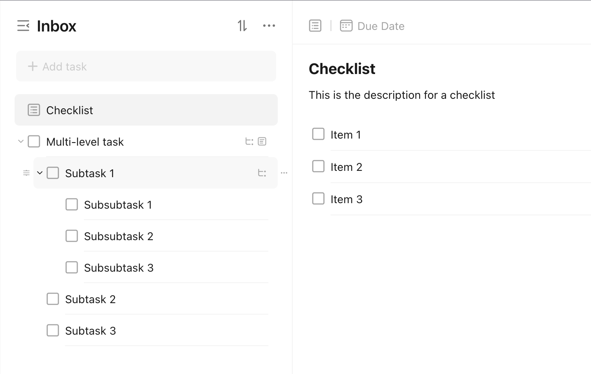

# Checklist vs Subtasks

TickTick supports both checklists (called [check items](https://help.ticktick.com/articles/7055782408586526720#check-items)) and subtasks (called [multilevel tasks](https://help.ticktick.com/articles/7055782219767349248)). These have very similar functionalities, and it can be difficult to determine when to use one over the other.

<figure markdown="span">
    <figcaption>Difference between a **checklist** and **subtasks**:</figcaption>
    { width="47%" align="left" }
    { width="47%" align="right" }
</figure>

## What Are the Differences Between Checklists and Subtasks?

### Features

Subtasks are fully-featured task objects, so they have all the bells and whistles of a task. On the other hand, checklists are not task objects, and are much more limited in functionality. They don't have much more than the ability to have a basic due date, and be able to be sorted.

Subtasks can be nested up to [5 levels deep](https://help.ticktick.com/articles/7055782219767349248#faqs), allowing for a more detailed organization of the separate tasks. Checklists just have the single level.

### Discovery

You can see in the example above how subtasks are treated as tasks, and take up real estate in the task list. Depending on your filter, they can be displayed by themselves separated from the parent task.

Subtasks also add to the overall task count. A task with three subtasks will have a task count of four whereas a checklist with three items will have a task count of one.

## When to Use Checklists vs Subtasks?

It is up to you to decide when to use checklists vs subtasks. [`r/ticktick`](https://www.reddit.com/r/ticktick/) is a good resource for anecdotes and tips on how to use TickTick, like [this breakdown of checklists vs subtasks](https://www.reddit.com/r/ticktick/comments/i2zdgc/comment/g19loia/?utm_source=share&utm_medium=web3x&utm_name=web3xcss&utm_term=1&utm_content=share_button).

If you need some guidance, checklists are probably suited for tasks that should be completed in a single period of time or work. Subtasks are more disjointed, and therefore lend themselves to being more useful for complex tasks that cannot be completed in a single period.
