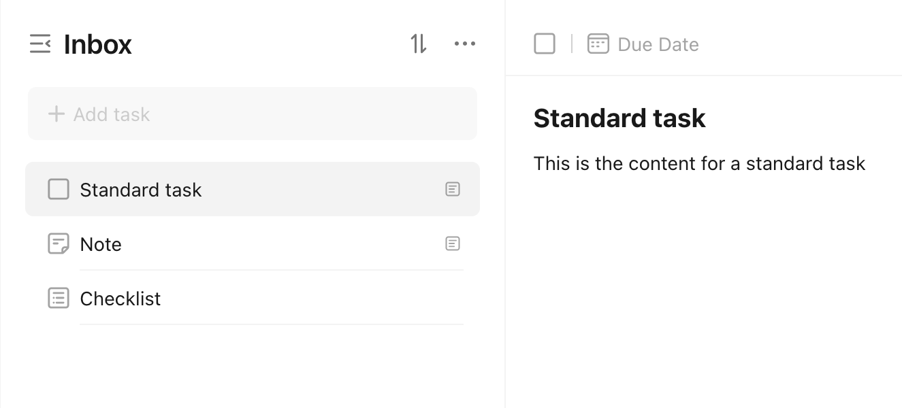
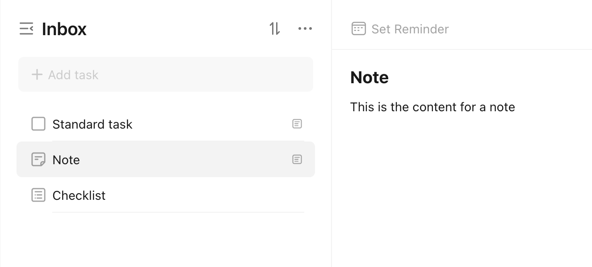
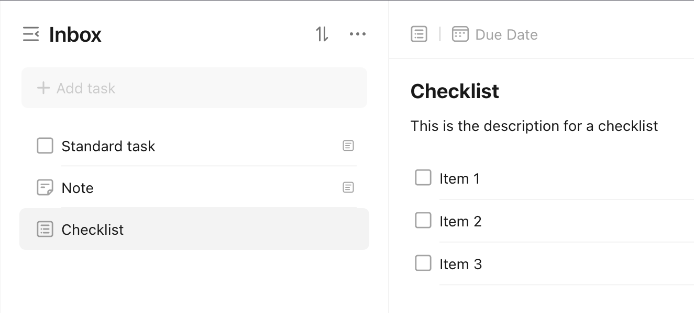

# Kinds of Tasks

There are three kinds of tasks in TickTick, which are encapsulated in the [`pyticktick.models.v2.Kind`](./../../../reference/models/v2/types/#pyticktick.models.v2.types.Kind) type:

```python
Kind = Literal["TEXT", "NOTE", "CHECKLIST"]
```

1. [Standard Tasks (`TEXT`)](#standard-tasks)
1. [Notes (`NOTE`)](#notes)
1. [Checklists (`CHECKLIST`)](#checklists)

## Standard Tasks

If you have used TickTick already, standard tasks should be relatively familiar. This is the default kind of task, and probably the most common kind of task in your TickTick account. They have a title, maybe some content, a due date, etc. They are extremely flexible, and can do most of what you require. You can visit [TickTick's documentation](https://help.ticktick.com/articles/7055782436621254656) for more information.

In certain cases, the standard task is not flexible enough, and that is where [Notes](#notes) and [Checklists](#checklists) come in.

<figure markdown="span">
    { width="75%" }
</figure>

## Notes

Notes are a lightweight way to capture thoughts, ideas, etc. By keeping these notes in TickTick, they are tightly integrated with your task system, which can be beneficial. They also can have reminders, so that you do not lose track of them. If you are making a task, you can convert it to a note after the fact, which can be helpful. If you want to learn more, you can check out [TickTick's documentation](https://help.ticktick.com/articles/7055780476358754304).

<figure markdown="span">
    { width="75%" }
</figure>

## Checklists

TickTick sometimes refers to these as a task with "check items". These are tasks that have a list of items that need to be completed. They are useful when you have a complex task that should be broken down into smaller tasks. You can learn a bit more with [TickTick's documentation](https://help.ticktick.com/articles/7055782408586526720#check-items).

<figure markdown="span">
    { width="75%" }
</figure>

!!! warning "Checklist vs Subtasks"

    TickTick has the ability to move tasks under other tasks, making them subtasks. This is different from a checklist. To understand the difference, you can go to [Checklists vs Subtasks](./checklists_vs_subtasks.md).
