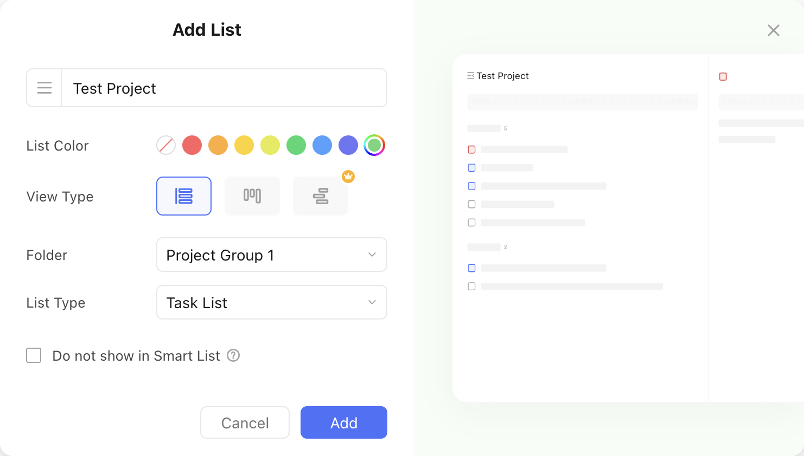
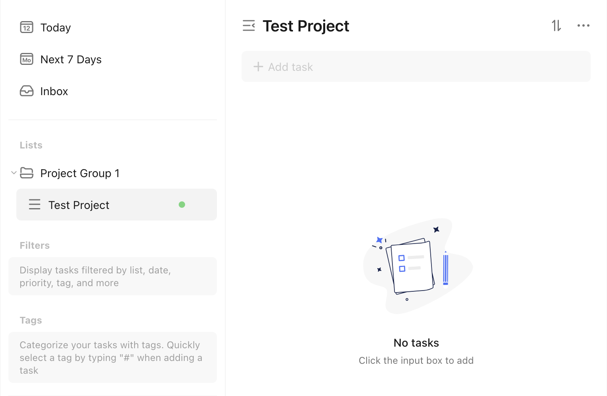

# Add a New Project to a Project Group

Let's assume we want to create a new project with the following properties:

- Name: Test Project
- Color: :material-checkbox-blank-circle:{ style="color: rgb(108, 213, 123) " } `rgb(108, 213, 123)`
- View Type: List
- List Type: Task List

We want to add this project to a project group with ID `6822056a27de221753d62eec`, and name `Project Group 1`.

This is what the creation would look like in the TickTick app:

<figure markdown="span">
    { width="90%" }
</figure>

This is what the `pyticktick` equivalent would look like:

=== "V2 - dict"

    ```python
    import json
    from pyticktick import Client

    project = client.post_project_v2(
        data={
            "add": [
                {
                    "name": "Test Project",
                    "color": "rgb(108, 213, 123)",
                    "view_mode": "list",
                    "kind": "TASK",
                    "group_id": "6822056a27de221753d62eec",
                },
            ],
        },
    )
    print(json.dumps(project.model_dump(mode="json"), indent=4))
    ```

    will return:

    ```json
    {
        "id2error": {},
        "id2etag": {
            "682221078f082a6819e4f03b": "7n5icwsb"
        }
    }
    ```

=== "V2 - model"

    ```python
    import json
    from pyticktick import Client
    from pyticktick.models.v2 import PostBatchProjectV2, CreateProjectV2

    client = Client()
    resp = client.post_project_v2(
        data=PostBatchProjectV2(
            add=[
                CreateProjectV2(
                    name="Test Project",
                    color="rgb(108, 213, 123)",
                    view_mode="list",
                    kind="TASK",
                    group_id="6822056a27de221753d62eec",
                ),
            ],
        ),
    )
    print(json.dumps(resp.model_dump(mode="json"), indent=4))
    ```

    will return:

    ```json
    {
        "id2error": {},
        "id2etag": {
            "682221078f082a6819e4f03b": "7n5icwsb"
        }
    }
    ```

<figure markdown="span">
    { width="90%" }
</figure>
