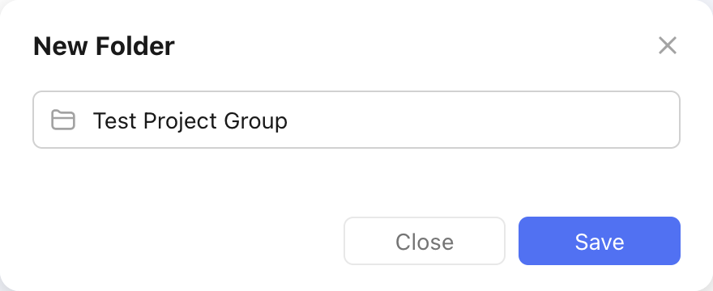
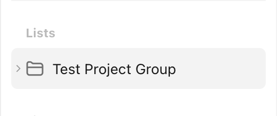

# Create a Project Group

Let's assume we want to create a new project group named `Test Project Group`:

This is what the creation would look like in the TickTick app:

<figure markdown="span">
    { width="400px" }
</figure>

This is what the `pyticktick` equivalent would look like:

=== "V2 - dict"

    ```python
    import json
    from pyticktick import Client

    client = Client()
    resp = client.post_project_group_v2(data={"add": [{"name": "Test Project Group"}]})
    print(json.dumps(resp.model_dump(mode="json"), indent=4))
    ```

    will return:

    ```json
    {
        "id2error": {},
        "id2etag": {
            "6821f8618f08de9a850d65ce": "g5zxj65x"
        }
    }
    ```

=== "V2 - model"

    ```python
    import json
    from pyticktick import Client
    from pyticktick.models.v2 import CreateProjectGroupV2, PostBatchProjectGroupV2

    client = Client()
    resp = client.post_project_group_v2(
        data=PostBatchProjectGroupV2(
            add=[CreateProjectGroupV2(name="Test Project Group")],
        ),
    )
    print(json.dumps(resp.model_dump(mode="json"), indent=4))
    ```

    will return:

    ```json
    {
        "id2error": {},
        "id2etag": {
            "6821f8618f08de9a850d65ce": "g5zxj65x"
        }
    }
    ```

Here is the end result in the TickTick app:

<figure markdown="span">
    { width="350px" }
</figure>
