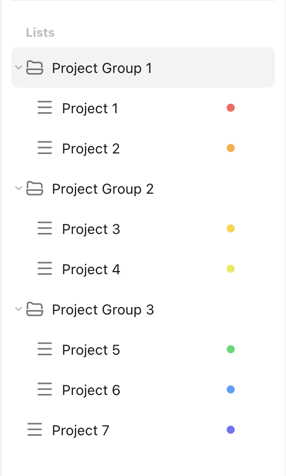

# Get All Project Groups

Let's assume we want to get all projects groups from the TickTick account. This is what the current projects look like in the TickTick app:

<figure markdown="span">
    { width="225px" }
</figure>

This is what the `pyticktick` equivalent would look like:

=== "V2"

    ```python
    import json
    from pyticktick import Client

    client = Client()
    resp = client.get_batch_v2()
    if resp.project_groups is None:
        print("No project groups found.")
    else:
        for pg in resp.project_groups:
            print(json.dumps(pg.model_dump(mode="json"), indent=4))
    ```

    will return:

    ```json
    {
        "etag": "khvuytut",
        "id": "6822056a27de221753d62eec",
        "name": "Project Group 1",
        "sort_option": null,
        "view_mode": null,
        "deleted": 0,
        "show_all": true,
        "sort_order": -8796093022208,
        "sort_type": "",
        "team_id": null,
        "timeline": null,
        "user_id": 126406863
    }
    {
        "etag": "8eamrfe8",
        "id": "6822057727de221753d62ef4",
        "name": "Project Group 3",
        "sort_option": null,
        "view_mode": null,
        "deleted": 0,
        "show_all": true,
        "sort_order": -8521215115264,
        "sort_type": "",
        "team_id": null,
        "timeline": null,
        "user_id": 126406863
    }
    {
        "etag": "y8vuqi2b",
        "id": "6822056f27de221753d62ef0",
        "name": "Project Group 2",
        "sort_option": null,
        "view_mode": null,
        "deleted": 0,
        "show_all": true,
        "sort_order": -8658654068736,
        "sort_type": "",
        "team_id": null,
        "timeline": null,
        "user_id": 126406863
    }
    ```
