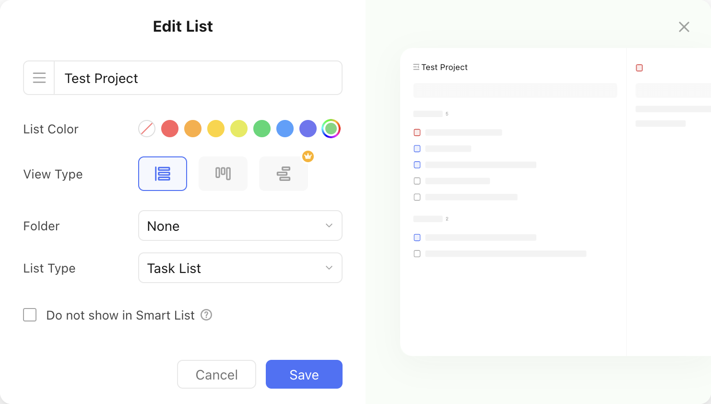

# Remove a Project From a Project Group

Let's assume we want to take the existing project that we used in the [add a new project to a project group recipe](add_a_new_project_to_a_project_group.md) and [add an existing project to a group recipe](add_an_existing_project_to_a_project_group.md) and remove it's from the project group.

The project ID to update is `682221078f082a6819e4f03b`.

This is what the update would look like in the TickTick app:

<figure markdown="span">
    { width="90%" }
</figure>

This is what the `pyticktick` equivalent would look like:

!!! warning

    The `group_id` is set to `#!python "NONE"` to remove the project from the group, rather than the standard `None` Python value.

=== "V2 - dict"

    ```python
    import json
    from pyticktick import Client

    client = Client()
    project = None
    resp = client.get_batch_v2()
    for p in resp.project_profiles:
        if p.id == "682221078f082a6819e4f03b":
            project = p
            break

    if project is None:
        msg = "Project not found"
        raise ValueError(msg)

    resp = client.post_project_v2(
        data={
            "update": [
                {
                    "id": project.id,
                    "name": project.name,
                    "color": project.color,
                    "view_mode": project.view_mode,
                    "kind": project.kind,
                    "sort_order": project.sort_order,
                    "group_id": "NONE",
                },
            ],
        },
    )
    print(json.dumps(resp.model_dump(mode="json"), indent=4))
    ```

    will return:

    ```json
    {
        "id2error": {},
        "id2etag": {
            "682221078f082a6819e4f03b": "4tw3d7ub"
        }
    }
    ```

=== "V2 - model"

    ```python
    import json
    from pyticktick import Client
    from pyticktick.models.v2 import PostBatchProjectV2, UpdateProjectV2

    client = Client()
    project = None
    resp = client.get_batch_v2()
    for p in resp.project_profiles:
        if p.id == "682221078f082a6819e4f03b":
            project = p
            break

    if project is None:
        msg = "Project not found"
        raise ValueError(msg)

    resp = client.post_project_v2(
        data=PostBatchProjectV2(
            update=[
                UpdateProjectV2(
                    id=project.id,
                    name=project.name,
                    color=project.color,
                    view_mode=project.view_mode,
                    kind=project.kind,
                    sort_order=project.sort_order,
                    group_id="NONE",
                ),
            ],
        ),
    )
    print(json.dumps(resp.model_dump(mode="json"), indent=4))
    ```

    will return:

    ```json
    {
        "id2error": {},
        "id2etag": {
            "682221078f082a6819e4f03b": "4tw3d7ub"
        }
    }
    ```
