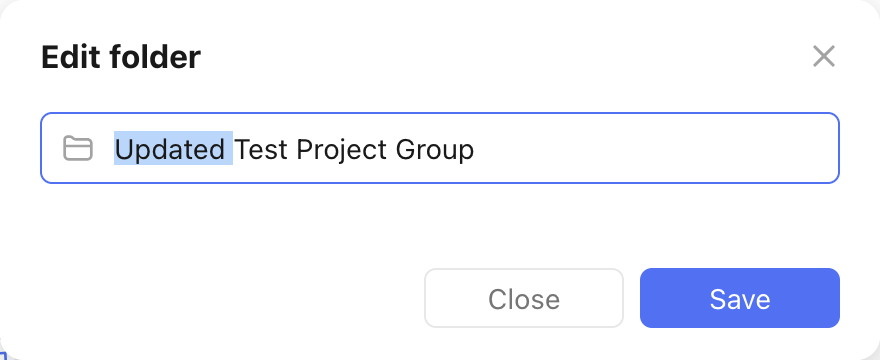

# Update a Project Group

Let's assume we want to update the project group from the [create project group recipe](create_a_project_group.md) with a new name: `Updated Test Project Group`.

It had a project group ID of `6821f8618f08de9a850d65ce`.

This is what the update would look like in the TickTick app:

<figure markdown="span">
    { width="400px" }
</figure>

This is what the `pyticktick` equivalent would look like:

=== "V2 - dict"

    ```python
    import json
    from pyticktick import Client

    client = Client()
    resp = client.post_project_group_v2(
        data={"update": [{"id": "6821f8618f08de9a850d65ce", "name": "Updated Test Project Group"}]}
    )
    print(json.dumps(resp.model_dump(mode="json"), indent=4))
    ```

    will return:

    ```json
    {
        "id2error": {},
        "id2etag": {
            "6821f8618f08de9a850d65ce": "0b43ssbf"
        }
    }
    ```

=== "V2 - model"

    ```python
    import json
    from pyticktick import Client
    from pyticktick.models.v2 import PostBatchProjectGroupV2, UpdateProjectGroupV2

    client = Client()
    resp = client.post_project_group_v2(
        data=PostBatchProjectGroupV2(
            update=[
                UpdateProjectGroupV2(
                    id="6821f8618f08de9a850d65ce",
                    name="Updated Test Project Group",
                ),
            ],
        ),
    )
    print(json.dumps(resp.model_dump(mode="json"), indent=4))
    ```

    will return:

    ```json
    {
        "id2error": {},
        "id2etag": {
            "6821f8618f08de9a850d65ce": "0b43ssbf"
        }
    }
    ```

<figure markdown="span">
    { width="350px" }
</figure>
