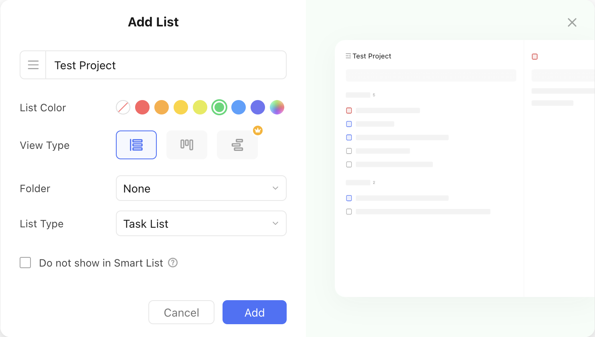
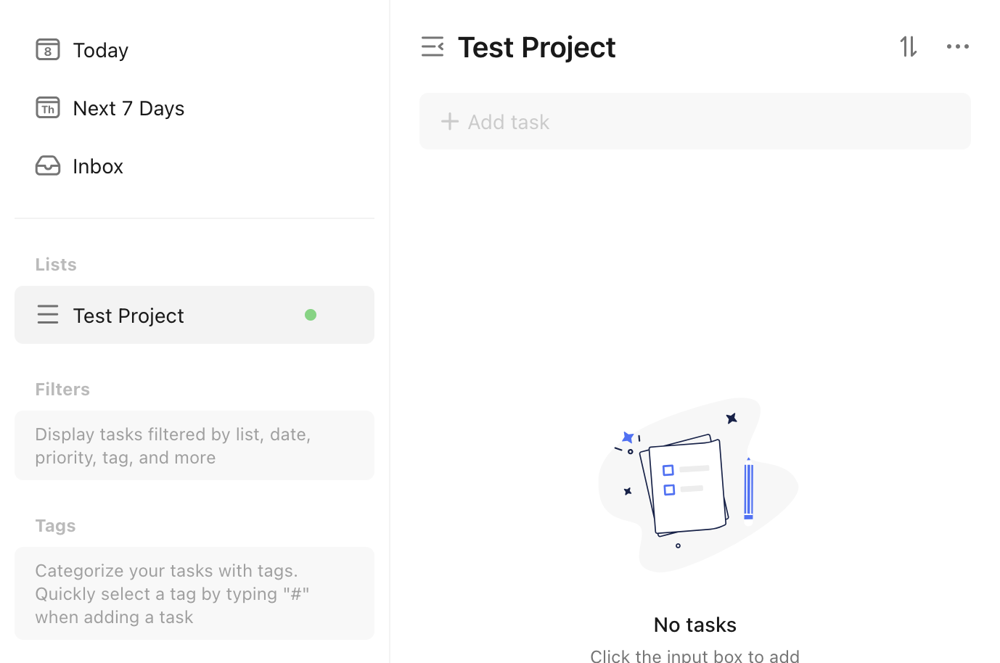

# Create a project

Let's assume we want to create a new project with the following properties:

- Name: Test Project
- Color: :material-checkbox-blank-circle:{ style="color: rgb(108, 213, 123) " } `rgb(108, 213, 123)`
- View Type: List
- List Type: Task List

This is what the creation would look like in the TickTick app:

<figure markdown="span">
    { width="90%" }
</figure>

This is what the `pyticktick` equivalent would look like:

=== "V1 - dict"

    ```python
    import json
    from pyticktick import Client

    client = Client()
    project = client.create_project_v1(
        data={
            "name": "Test Project",
            "color": "rgb(108, 213, 123)",
            "view_mode": "list",
            "kind": "TASK",
        },
    )
    print(json.dumps(project.model_dump(mode="json"), indent=4))
    ```

    will return:

    ```json
    {
        "id": "681ce1d98f0870ba1dd77ebe",
        "name": "Test Project",
        "color": "#6cd57b",
        "sort_order": 0,
        "closed": null,
        "group_id": null,
        "view_mode": "list",
        "permission": null,
        "kind": "TASK"
    }
    ```

=== "V1 - model"

    ```python
    import json
    from pyticktick import Client
    from pyticktick.models.v1 import CreateProjectV1

    client = Client()
    project = client.create_project_v1(
        data=CreateProjectV1(
            name="Test Project",
            color="rgb(108, 213, 123)",
            view_mode="list",
            kind="TASK",
        ),
    )
    print(json.dumps(project.model_dump(mode="json"), indent=4))
    ```

    will return:

    ```json
    {
        "id": "681ce1d98f0870ba1dd77ebe",
        "name": "Test Project",
        "color": "#6cd57b",
        "sort_order": 0,
        "closed": null,
        "group_id": null,
        "view_mode": "list",
        "permission": null,
        "kind": "TASK"
    }
    ```

=== "V2 - dict"

    ```python
    import json
    from pyticktick import Client

    client = Client()
    resp = client.post_project_v2(
        data={
            "add": [
                {
                    "name": "Test Project",
                    "color": "rgb(108, 213, 123)",
                    "view_mode": "list",
                    "kind": "TASK",
                },
            ],
        },
    )

    print(json.dumps(resp.model_dump(mode="json"), indent=4))
    ```

    will return:

    ```
    {
        "id2error": {},
        "id2etag": {
            "681ce1d98f0870ba1dd77ebe": "totogen5"
        }
    }
    ```

=== "V2 - model"

    ```python
    import json
    from pyticktick import Client
    from pyticktick.models.v2 import PostBatchProjectV2, CreateProjectV2

    client = Client()
    resp = client.post_project_v2(
        data=PostBatchProjectV2(
            add=[
                CreateProjectV2(
                    name="Test Project",
                    color="rgb(108, 213, 123)",
                    view_mode="list",
                    kind="TASK",
                ),
            ],
        ),
    )

    print(json.dumps(resp.model_dump(mode="json"), indent=4))
    ```

    will return:

    ```
    {
        "id2error": {},
        "id2etag": {
            "681ce1d98f0870ba1dd77ebe": "totogen5"
        }
    }
    ```

Here is the end result in the TickTick app:

<figure markdown="span">
    { width="90%" }
</figure>
