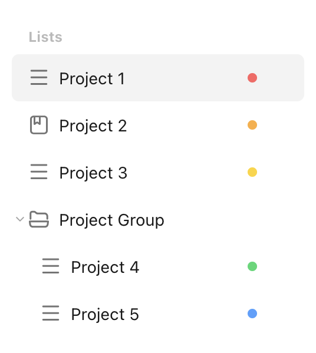

# Get All Projects

Let's assume we want to get all projects from the TickTick account. This is what the current projects look like in the TickTick app:

<figure markdown="span">
    { width="225px" }
</figure>

This is what the `pyticktick` equivalent would look like:

=== "V1"

    ```python
    import json
    from pyticktick import Client

    client = Client()
    projects = client.get_projects_v1()
    for p in projects:
        print(json.dumps(p.model_dump(mode="json"), indent=4))
    ```

    will return:

    ```json
    {
        "id": "681d63f18f0892430630d16b",
        "name": "Project 1",
        "color": "#FF6161",
        "sort_order": -3298534883328,
        "closed": null,
        "group_id": null,
        "view_mode": "list",
        "permission": null,
        "kind": "TASK"
    }
    {
        "id": "681d63fe8f0892430630d22b",
        "name": "Project 2",
        "color": "#FFAC38",
        "sort_order": -2199023255552,
        "closed": null,
        "group_id": null,
        "view_mode": "list",
        "permission": null,
        "kind": "NOTE"
    }
    {
        "id": "681d64028f0892430630d286",
        "name": "Project 3",
        "color": "#FFD324",
        "sort_order": 0,
        "closed": null,
        "group_id": null,
        "view_mode": "kanban",
        "permission": null,
        "kind": "TASK"
    }
    {
        "id": "681d640f8f0892430630d337",
        "name": "Project 4",
        "color": "#35D870",
        "sort_order": 1191137596757,
        "closed": null,
        "group_id": "681d642627de226ddc24b291",
        "view_mode": "list",
        "permission": null,
        "kind": "TASK"
    }
    {
        "id": "681d641f8f0892430630d4c4",
        "name": "Project 5",
        "color": "#4CA1FF",
        "sort_order": 1282763565738,
        "closed": null,
        "group_id": "681d642627de226ddc24b291",
        "view_mode": "list",
        "permission": null,
        "kind": "TASK"
    }
    ```

=== "V2"

    ```python
    import json
    from pyticktick import Client

    client = Client()
    resp = client.get_batch_v2()
    for p in resp.project_profiles:
        print(json.dumps(p.model_dump(mode="json"), indent=4))
    ```

    will return:

    ```json
    {
        "color": "#ff6161",
        "etag": "s83jq7d8",
        "group_id": null,
        "id": "681d63f18f0892430630d16b",
        "in_all": true,
        "kind": "TASK",
        "modified_time": "2025-05-09T02:10:16.671000Z",
        "name": "Project 1",
        "sort_option": null,
        "view_mode": "list",
        "barcode_need_audit": false,
        "is_owner": true,
        "sort_order": -3298534883328,
        "sort_type": null,
        "user_count": 1,
        "closed": null,
        "muted": false,
        "transferred": null,
        "notification_options": null,
        "team_id": null,
        "permission": null,
        "timeline": null,
        "need_audit": true,
        "open_to_team": false,
        "team_member_permission": null,
        "source": 1,
        "show_type": null,
        "reminder_type": null
    }
    {
        "color": "#ffac38",
        "etag": "y9swo1kx",
        "group_id": null,
        "id": "681d63fe8f0892430630d22b",
        "in_all": true,
        "kind": "NOTE",
        "modified_time": "2025-05-09T02:11:52.881000Z",
        "name": "Project 2",
        "sort_option": null,
        "view_mode": "list",
        "barcode_need_audit": false,
        "is_owner": true,
        "sort_order": -2199023255552,
        "sort_type": null,
        "user_count": 1,
        "closed": null,
        "muted": false,
        "transferred": null,
        "notification_options": null,
        "team_id": null,
        "permission": null,
        "timeline": null,
        "need_audit": true,
        "open_to_team": false,
        "team_member_permission": null,
        "source": 1,
        "show_type": null,
        "reminder_type": null
    }
    {
        "color": "#ffd324",
        "etag": "k0b2mdfj",
        "group_id": null,
        "id": "681d64028f0892430630d286",
        "in_all": true,
        "kind": "TASK",
        "modified_time": "2025-05-09T02:11:47.739000Z",
        "name": "Project 3",
        "sort_option": null,
        "view_mode": "kanban",
        "barcode_need_audit": false,
        "is_owner": true,
        "sort_order": 0,
        "sort_type": null,
        "user_count": 1,
        "closed": null,
        "muted": false,
        "transferred": null,
        "notification_options": null,
        "team_id": null,
        "permission": null,
        "timeline": null,
        "need_audit": true,
        "open_to_team": false,
        "team_member_permission": null,
        "source": 1,
        "show_type": null,
        "reminder_type": null
    }
    {
        "color": "#35d870",
        "etag": "b8c5nspw",
        "group_id": "681d642627de226ddc24b291",
        "id": "681d640f8f0892430630d337",
        "in_all": true,
        "kind": "TASK",
        "modified_time": "2025-05-09T02:11:42.352000Z",
        "name": "Project 4",
        "sort_option": null,
        "view_mode": "list",
        "barcode_need_audit": false,
        "is_owner": true,
        "sort_order": 1191137596757,
        "sort_type": null,
        "user_count": 1,
        "closed": null,
        "muted": false,
        "transferred": null,
        "notification_options": null,
        "team_id": null,
        "permission": null,
        "timeline": null,
        "need_audit": true,
        "open_to_team": false,
        "team_member_permission": null,
        "source": 1,
        "show_type": null,
        "reminder_type": null
    }
    {
        "color": "#4ca1ff",
        "etag": "svu9l4di",
        "group_id": "681d642627de226ddc24b291",
        "id": "681d641f8f0892430630d4c4",
        "in_all": true,
        "kind": "TASK",
        "modified_time": "2025-05-09T02:10:55.986000Z",
        "name": "Project 5",
        "sort_option": null,
        "view_mode": "list",
        "barcode_need_audit": false,
        "is_owner": true,
        "sort_order": 1282763565738,
        "sort_type": null,
        "user_count": 1,
        "closed": null,
        "muted": false,
        "transferred": null,
        "notification_options": null,
        "team_id": null,
        "permission": null,
        "timeline": null,
        "need_audit": true,
        "open_to_team": false,
        "team_member_permission": null,
        "source": 1,
        "show_type": null,
        "reminder_type": null
    }
    ```
