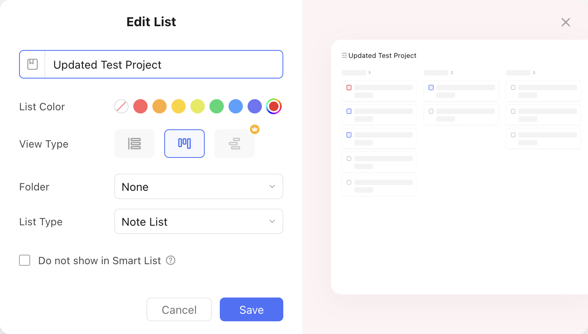
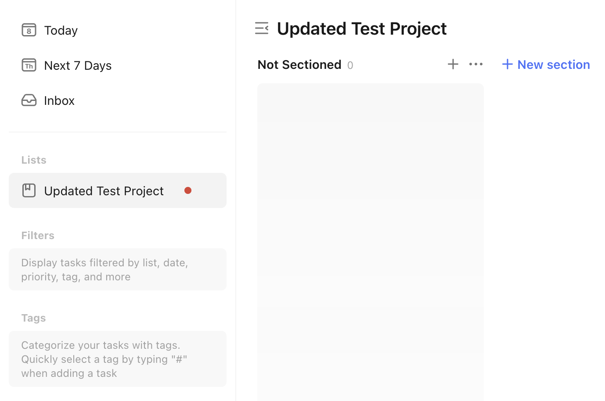

# Update a Project

Let's assume we want to update the project from the [create project recipe](create_a_project.md) with the following properties:

- Name: Updated Test Project
- Color: :material-checkbox-blank-circle:{ style="color: rgb(220, 66, 51) " } `rgb(220, 66, 51)`
- View Type: Kanban
- List Type: Note List

It's project ID is `681ce1d98f0870ba1dd77ebe`.

This is what the update would look like in the TickTick app:

<figure markdown="span">
    { width="90%" }
</figure>

This is what the `pyticktick` equivalent would look like:

=== "V1 - dict"

    ```python
    import json
    from pyticktick import Client

    client = Client()
    project = client.update_project_v1(
        project_id="681ce1d98f0870ba1dd77ebe",
        data={
            "name": "Updated Test Project",
            "color": "rgb(220, 66, 51)",
            "view_mode": "kanban",
            "kind": "NOTE",
        },
    )

    print(json.dumps(project.model_dump(mode="json"), indent=4))
    ```

    will return:

    ```json
    {
        "id": "681ce1d98f0870ba1dd77ebe",
        "name": "Updated Test Project",
        "color": "#dc4233",
        "sort_order": 0,
        "closed": null,
        "group_id": null,
        "view_mode": "kanban",
        "permission": null,
        "kind": "NOTE"
    }
    ```

=== "V1 - model"

    ```python
    import json
    from pyticktick import Client
    from pyticktick.models.v1 import UpdateProjectV1

    client = Client()
    project = client.update_project_v1(
        project_id="681ce1d98f0870ba1dd77ebe",
        data=UpdateProjectV1(
            name="Updated Test Project",
            color="rgb(220, 66, 51)",
            view_mode="kanban",
            kind="NOTE",
        ),
    )

    print(json.dumps(project.model_dump(mode="json"), indent=4))
    ```

    will return:

    ```json
    {
        "id": "681ce1d98f0870ba1dd77ebe",
        "name": "Updated Test Project",
        "color": "#dc4233",
        "sort_order": 0,
        "closed": null,
        "group_id": null,
        "view_mode": "kanban",
        "permission": null,
        "kind": "NOTE"
    }
    ```

=== "V2 - dict"

    ```python
    import json
    from pyticktick import Client

    client = Client()
    resp = client.post_project_v2(
        data={
            "update": [
                {
                    "id": "681ce1d98f0870ba1dd77ebe",
                    "name": "Updated Test Project",
                    "color": "rgb(220, 66, 51)",
                    "view_mode": "kanban",
                    "kind": "NOTE",
                },
            ],
        },
    )

    print(json.dumps(resp.model_dump(mode="json"), indent=4))
    ```

    will return:

    ```json
    {
        "id2error": {},
        "id2etag": {
            "681e23d68f083fe2c3a7c560": "pm7kzed4"
        }
    }
    ```

=== "V2 - model"

    ```python
    import json
    from pyticktick import Client
    from pyticktick.models.v2 import PostBatchProjectV2, UpdateProjectV2

    client = Client()
    resp = client.post_project_v2(
        data=PostBatchProjectV2(
            update=[
                UpdateProjectV2(
                    id="681ce1d98f0870ba1dd77ebe",
                    name="Updated Test Project",
                    color="rgb(220, 66, 51)",
                    view_mode="kanban",
                    kind="NOTE",
                ),
            ],
        ),
    )

    print(json.dumps(resp.model_dump(mode="json"), indent=4))
    ```

    will return:

    ```json
    {
        "id2error": {},
        "id2etag": {
            "681e23d68f083fe2c3a7c560": "pm7kzed4"
        }
    }
    ```

Here is the end result in the TickTick app:

<figure markdown="span">
    { width="90%" }
</figure>
