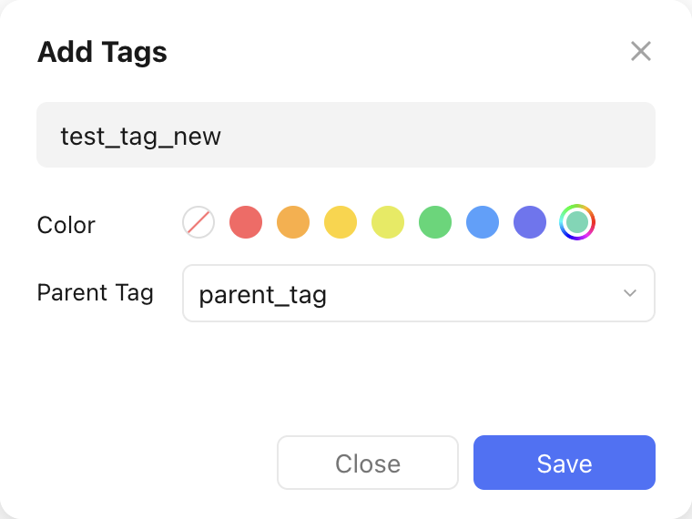
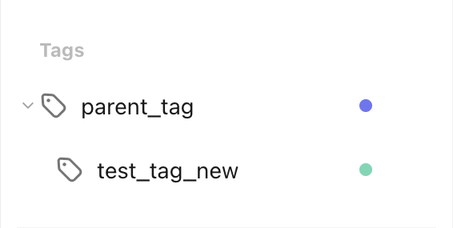

# Add a Parent Tag to a New Tag

Let's assume we want to create a new tag, similar to the one in the [create tag recipe](create_a_tag.md), but we want to add a parent tag (`parent_tag`) to it during creation. We want the new tag to have the name `test_tag_new` and the color :material-checkbox-blank-circle:{ style="color: rgb(100, 216, 180) " } `rgb(100, 216, 180)`.

This is what the creation would look like in the TickTick app:

<figure markdown="span">
    { width="350px" }
</figure>

This is what the `pyticktick` equivalent would look like:

=== "V2 - dict"

    ```python
    import json
    from pyticktick import Client

    client = Client()
    resp = client.post_tag_v2(
        data={
            "add": [
                {
                    "label": "test_tag_new",
                    "color": "rgb(100, 216, 180)",
                    "parent": "parent_tag",
                },
            ],
        },
    )
    print(json.dumps(resp.model_dump(mode="json"), indent=4))
    ```

    will return:

    ```json
    {
        "id2error": {},
        "id2etag": {
            "test_tag_new": "tp4ij6kx"
        }
    }
    ```

=== "V2 - model"

    ```python
    import json
    from pyticktick import Client
    from pyticktick.models.v2 import PostBatchTagV2, CreateTagV2

    client = Client()
    resp = client.post_tag_v2(
        data=PostBatchTagV2(
            add=[
                CreateTagV2(
                    label="test_tag_new",
                    color="rgb(100, 216, 180)",
                    parent="parent_tag",
                ),
            ],
        ),
    )
    print(json.dumps(resp.model_dump(mode="json"), indent=4))
    ```

    will return:

    ```json
    {
        "id2error": {},
        "id2etag": {
            "test_tag_new": "tp4ij6kx"
        }
    }
    ```

Here is the end result in the TickTick app:

<figure markdown="span">
    { width="300px" }
</figure>
