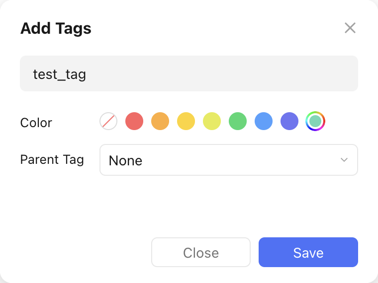
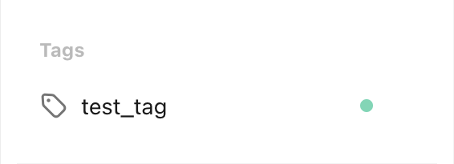

# Create a Tag

Let's assume we want to create a new tag with the following properties:

- Name: test_tag
- Color: :material-checkbox-blank-circle:{ style="color: rgb(100, 216, 180) " } `rgb(100, 216, 180)`

This is what the creation would look like in the TickTick app:

<figure markdown="span">
    { width="350px" }
</figure>

This is what the `pyticktick` equivalent would look like:

=== "V2 - dict"

    ```python
    import json
    from pyticktick import Client

    client = Client()
    resp = client.post_tag_v2(
        data={"add": [{"label": "test_tag", "color": "rgb(100, 216, 180)"}]},
    )
    print(json.dumps(resp.model_dump(mode="json"), indent=4))
    ```

    will return:

    ```json
    {
        "id2error": {},
        "id2etag": {
            "test_tag": "l1y6w0zu"
        }
    }
    ```

=== "V2 - model"

    ```python
    import json
    from pyticktick import Client
    from pyticktick.models.v2 import PostBatchTagV2, CreateTagV2

    client = Client()
    resp = client.post_tag_v2(
        data=PostBatchTagV2(
            add=[CreateTagV2(label="test_tag", color="rgb(100, 216, 180)")],
        )
    )
    print(json.dumps(resp.model_dump(mode="json"), indent=4))
    ```

    will return:

    ```json
    {
        "id2error": {},
        "id2etag": {
            "test_tag": "l1y6w0zu"
        }
    }
    ```

Here is the end result in the TickTick app:

<figure markdown="span">
    { width="300px" }
</figure>
