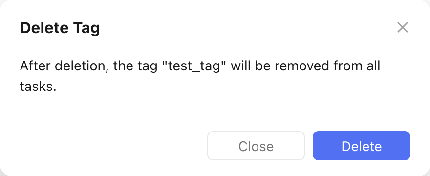

# Delete a Tag

Let's assume we want to delete the tag `test_tag` from the [create tag recipe](create_a_tag.md).

This is what the deletion would look like in the TickTick app:

<figure markdown="span">
    { width="400px" }
</figure>

This is what the `pyticktick` equivalent would look like:

=== "V2 - dict"

    ```python
    from pyticktick import Client

    client = Client()
    resp = client.delete_tag_v2(data={"name": "test_tag"})
    ```

    This will not return anything.

=== "V2 - model"

    ```python
    from pyticktick import Client
    from pyticktick.models.v2 import DeleteTagV2

    client = Client()
    client.delete_tag_v2(data=DeleteTagV2(name="test_tag"))
    ```

    This will not return anything.
