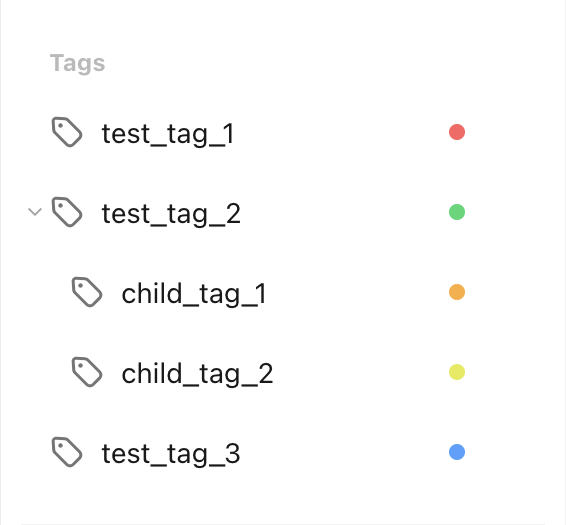

# Get a Tag by Name

Let's assume we want to get a tag with the name `test_tag_2`, like the one found in the [get all tags recipe](get_all_tags.md):

<figure markdown="span">
    { width="300px" }
</figure>

This is what the `pyticktick` code would look like:

=== "V2"

    ```python
    import json
    from pyticktick import Client

    client = Client()
    resp = client.get_batch_v2()
    for t in resp.tags:
        if t.name == "test_tag_2":
            print(json.dumps(t.model_dump(mode="json"), indent=4))
    ```

    will return:

    ```json
    {
        "color": "#35d870",
        "etag": "z0hmmvwz",
        "label": "test_tag_2",
        "name": "test_tag_2",
        "parent": null,
        "raw_name": "test_tag_2",
        "sort_option": {
            "group_by": "tag",
            "order_by": "dueDate"
        },
        "sort_type": "tag",
        "sort_order": 0,
        "timeline": {
            "range": null,
            "sort_type": null,
            "sort_option": {
                "group_by": "tag",
                "order_by": "sortOrder"
            }
        },
        "type": 1
    }
    ```
