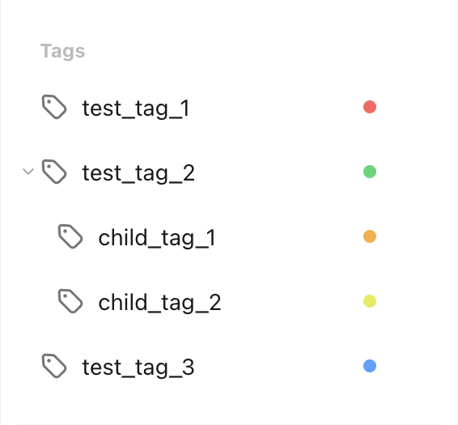

# Get All Tags

Let's assume we want to get all tags from the TickTick account. This is what the current tags look like in the TickTick app:

<figure markdown="span">
    { width="300px" }
</figure>

This is what the `pyticktick` equivalent would look like:

=== "V2"

    ```python
    import json
    from pyticktick import Client

    client = Client()
    resp = client.get_batch_v2()
    for t in resp.tags:
        print(json.dumps(t.model_dump(mode="json"), indent=4))
    ```

    will return:

    ```json
    {
        "color": "#ffac38",
        "etag": "wtwmruse",
        "label": "child_tag_1",
        "name": "child_tag_1",
        "parent": "test_tag_2",
        "raw_name": "child_tag_1",
        "sort_option": null,
        "sort_type": "project",
        "sort_order": 549755813888,
        "timeline": null,
        "type": 1
    }
    {
        "color": "#e6ea49",
        "etag": "cb4av5ds",
        "label": "child_tag_2",
        "name": "child_tag_2",
        "parent": "test_tag_2",
        "raw_name": "child_tag_2",
        "sort_option": null,
        "sort_type": "project",
        "sort_order": 824633720832,
        "timeline": null,
        "type": 1
    }
    {
        "color": "#ff6161",
        "etag": "1ff4zj17",
        "label": "test_tag_1",
        "name": "test_tag_1",
        "parent": null,
        "raw_name": "test_tag_1",
        "sort_option": null,
        "sort_type": "project",
        "sort_order": -1099511627776,
        "timeline": null,
        "type": 1
    }
    {
        "color": "#35d870",
        "etag": "z0hmmvwz",
        "label": "test_tag_2",
        "name": "test_tag_2",
        "parent": null,
        "raw_name": "test_tag_2",
        "sort_option": {
            "group_by": "tag",
            "order_by": "dueDate"
        },
        "sort_type": "tag",
        "sort_order": 0,
        "timeline": {
            "range": null,
            "sort_type": null,
            "sort_option": {
                "group_by": "tag",
                "order_by": "sortOrder"
            }
        },
        "type": 1
    }
    {
        "color": "#4ca1ff",
        "etag": "nsij31jo",
        "label": "test_tag_3",
        "name": "test_tag_3",
        "parent": null,
        "raw_name": "test_tag_3",
        "sort_option": null,
        "sort_type": "project",
        "sort_order": 1099511627776,
        "timeline": null,
        "type": 1
    }
    ```
