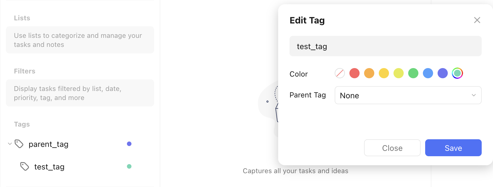
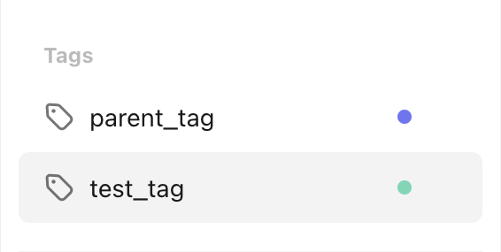

# Remove a Parent Tag

Let's assume we want to remove the parent tag `parent_tag` from the tag `test_tag`, undoing the work we did in the [add a parent tag to an existing tag recipe](add_a_parent_tag_to_an_existing_tag.md).

This is what the removal would look like in the TickTick app:

<figure markdown="span">
    { width="90%" }
</figure>

This is what the `pyticktick` equivalent would look like:

=== "V2 - dict"

    ```python
    import json
    from pyticktick import Client

    client = Client()
    resp = client.get_batch_v2()
    tag = None
    for t in resp.tags:
        if t.name == "test_tag":
            tag = t
            break

    if tag is None:
        msg = "Tag not found"
        raise ValueError(msg)

    resp = client.post_tag_v2(
        data={"update": [{"label": tag.label, "parent": "", "color": tag.color}]},
    )
    print(json.dumps(resp.model_dump(mode="json"), indent=4))
    ```

    will return:

    ```json
    {
        "id2error": {},
        "id2etag": {
            "test_tag": "l1y6w0zu"
        }
    }
    ```

=== "V2 - model"

    ```python
    import json
    from pyticktick import Client
    from pyticktick.models.v2 import PostBatchTagV2, UpdateTagV2

    client = Client()
    resp = client.get_batch_v2()
    tag = None
    for t in resp.tags:
        if t.name == "test_tag":
            tag = t
            break

    if tag is None:
        msg = "Tag not found"
        raise ValueError(msg)

    resp = client.post_tag_v2(
        data=PostBatchTagV2(
            update=[UpdateTagV2(label=tag.label, parent="", color=tag.color)],
        ),
    )
    print(json.dumps(resp.model_dump(mode="json"), indent=4))
    ```

    will return:

    ```json
    {
        "id2error": {},
        "id2etag": {
            "test_tag": "l2i9kz8b"
        }
    }
    ```

Here is the end result in the TickTick app:

<figure markdown="span">
    { width="300px" }
</figure>
