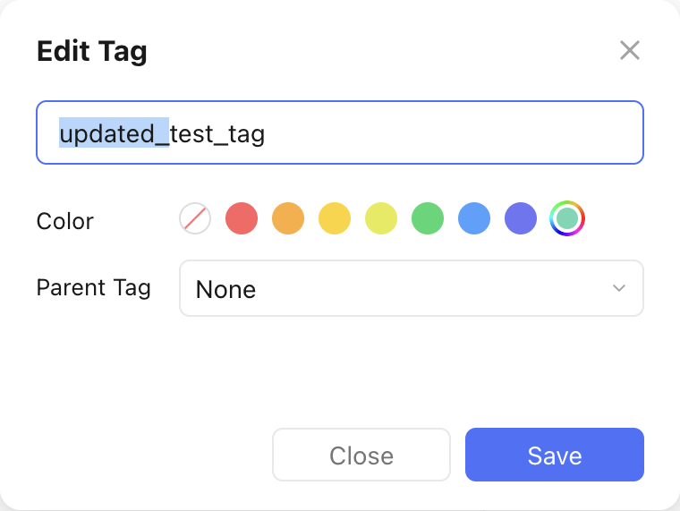

# Rename a Tag

Let's assume we want to rename the tag `test_tag` from the [create tag recipe](create_a_tag.md). We now want it to have the name `updated_test_tag`.

This is what the renaming would look like in the TickTick app:

<figure markdown="span">
    { width="350px" }
</figure>

This is what the `pyticktick` equivalent would look like:

=== "V2 - dict"

    ```python
    import json
    from pyticktick import Client

    client = Client()
    resp = client.put_rename_tag_v2(data={"name": "test_tag", "new_name": "updated_test_tag"})
    ```

    will not return anything if successful.

=== "V2 - model"

    ```python
    import json
    from pyticktick import Client
    from pyticktick.models.v2 import RenameTagV2

    client = Client()
    client.put_rename_tag_v2(
        data=RenameTagV2(
            name="test_tag",
            new_name="updated_test_tag",
        ),
    )
    ```

    This will not return anything if successful.

Here is the end result in the TickTick app:

<figure markdown="span">
    { width="300px" }
</figure>
