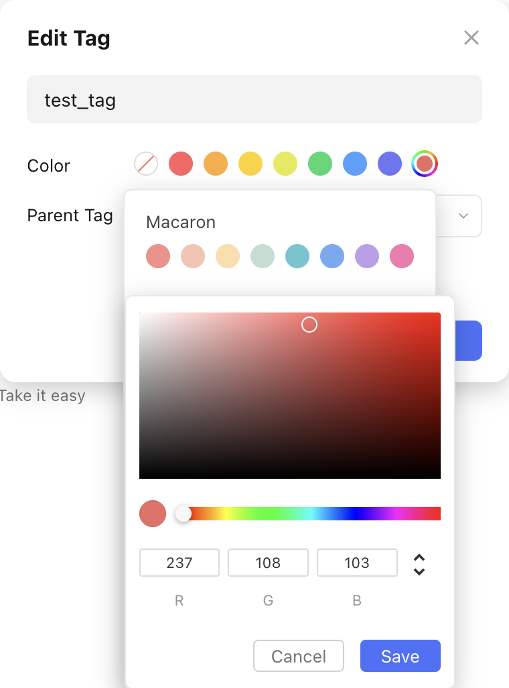
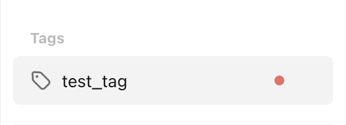

# Update a Tag

Let's assume we want to update the tag `test_tag` from the [create tag recipe](create_a_tag.md). We now want it to have a new color: :material-checkbox-blank-circle:{ style="color: rgb(237, 108, 103) " } `rgb(237, 108, 103)`.

??? question "What about renaming tags?"

    The [`post_tag_v2`](./../../../reference/client/v2.md#pyticktick.client.Client.post_tag_v2) function does not support renaming tags, unlike most other `post_XXX_v2` functions. To see how this is done, check out the [rename tag recipe](rename_a_tag.md).

This is what the update would look like in the TickTick app:

<figure markdown="span">
    { width="350px" }
</figure>

This is what the `pyticktick` equivalent would look like:

=== "V2 -dict"

    ```python
    import json
    from pyticktick import Client

    client = Client()
    resp = client.post_tag_v2(
        data={"update": [{"label": "test_tag", "color": "rgb(237, 108, 103)"}]},
    )
    print(json.dumps(resp.model_dump(mode="json"), indent=4))
    ```

    will return:

    ```json
    {
        "id2error": {},
        "id2etag": {
            "test_tag": "txtbko2d"
        }
    }
    ```

=== "V2 - model"

    ```python
    import json
    from pyticktick import Client
    from pyticktick.models.v2 import PostBatchTagV2, UpdateTagV2

    client = Client()
    resp = client.post_tag_v2(
        data=PostBatchTagV2(
            update=[UpdateTagV2(label="test_tag", color="rgb(237, 108, 103)")],
        ),
    )
    print(json.dumps(resp.model_dump(mode="json"), indent=4))
    ```

    will return:

    ```json
    {
        "id2error": {},
        "id2etag": {
            "test_tag": "txtbko2d"
        }
    }
    ```

Here is the end result in the TickTick app:

<figure markdown="span">
    { width="300px" }
</figure>
