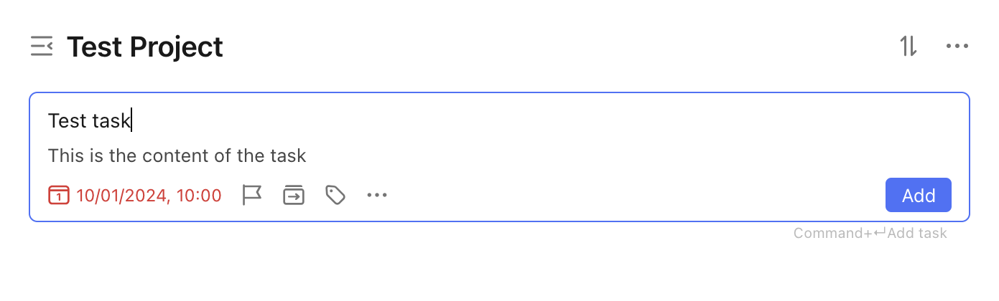
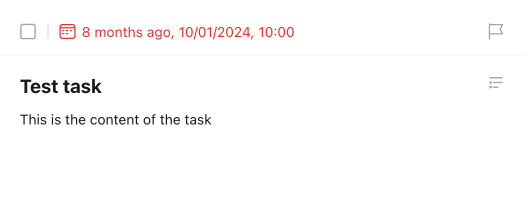

# Create a Basic Task

Let's assume we want to create a new task with the following properties:

- Name: `Test Task`
- Description: `This is the content of the task`
- Due Date: `2024-10-01` at `10:00 AM`
- Alarm: At the time of the due date
- Time zone: `Chicago`

This will be created under the project with ID `683217b48f08892e6997ef03`, called `Test Project`.

This is what the creation would look like in the TickTick app:

<figure markdown="span">
    { width="90%" }
</figure>

This is what the `pyticktick` equivalent would look like:

=== "V1 - dict"

    ```python
    import json
    from pyticktick import Client

    client = Client()
    task = client.create_task_v1(
        data={
            "title": "Test Task",
            "content": "This is the content of the task",
            "due_date": "2024-10-01T10:00:00+0000",
            "reminders": ["TRIGGER:PT0S"],
            "time_zone": "America/Chicago",
            "project_id": "683217b48f08892e6997ef03",
        },
    )
    print(json.dumps(task.model_dump(mode="json"), indent=4))
    ```

    will return:

    ```json
    {
        "id": "68336a02ec201a48c7aadedf",
        "project_id": "683217b48f08892e6997ef03",
        "title": "Test Task",
        "is_all_day": false,
        "completed_time": null,
        "content": "This is the content of the task",
        "desc": null,
        "due_date": "2024-10-01T10:00:00.000+0000",
        "items": null,
        "priority": 0,
        "reminders": [
            "TRIGGER:PT0S"
        ],
        "repeat_flag": null,
        "sort_order": -8796093022208,
        "start_date": "2024-10-01T10:00:00.000+0000",
        "status": false,
        "time_zone": "America/Chicago"
    }
    ```

=== "V1 - model"

    ```python
    import json
    from pyticktick import Client
    from pyticktick.models.v1 import CreateTaskV1

    client = Client()
    task = client.create_task_v1(
        data=CreateTaskV1(
            title="Test Task",
            content="This is the content of the task",
            due_date="2024-10-01T10:00:00+0000",
            reminders=["TRIGGER:PT0S"],
            time_zone="America/Chicago",
            project_id="683217b48f08892e6997ef03",
        ),
    )
    print(json.dumps(task.model_dump(mode="json"), indent=4))
    ```

    will return:

    ```json
    {
        "id": "68336a02ec201a48c7aadedf",
        "project_id": "683217b48f08892e6997ef03",
        "title": "Test Task",
        "is_all_day": false,
        "completed_time": null,
        "content": "This is the content of the task",
        "desc": null,
        "due_date": "2024-10-01T10:00:00.000+0000",
        "items": null,
        "priority": 0,
        "reminders": [
            "TRIGGER:PT0S"
        ],
        "repeat_flag": null,
        "sort_order": -8796093022208,
        "start_date": "2024-10-01T10:00:00.000+0000",
        "status": false,
        "time_zone": "America/Chicago"
    }
    ```

=== "V2 - dict"

    ```python
    import json
    from pyticktick import Client

    client = Client()
    resp = client.post_task_v2(
        data={
            "add": [
                {
                    "title": "Test Task",
                    "content": "This is the content of the task",
                    "due_date": "2024-10-01T10:00:00",
                    "reminders": [{"trigger": "TRIGGER:PT0S"}],
                    "time_zone": "America/Chicago",
                    "project_id": "683217b48f08892e6997ef03",
                    "kind": "TEXT",
                },
            ],
        },
    )
    print(json.dumps(resp.model_dump(mode="json"), indent=4))
    ```

    will return:

    ```json
    {
        "id2error": {},
        "id2etag": {
            "68336a02ec201a48c7aadedf": "m2mvkd31"
        }
    }
    ```

=== "V2 - model"

    ```python
    import json
    from pyticktick import Client
    from pyticktick.models.v2 import CreateTaskReminderV2, CreateTaskV2, PostBatchTaskV2

    client = Client()
    resp = client.post_task_v2(
        data=PostBatchTaskV2(
            add=[
                CreateTaskV2(
                    title="Test Task",
                    content="This is the content of the task",
                    due_date="2024-10-01T10:00:00",
                    reminders=[CreateTaskReminderV2(trigger="TRIGGER:PT0S")],
                    time_zone="America/Chicago",
                    project_id="683217b48f08892e6997ef03",
                    kind="TEXT",
                ),
            ],
        ),
    )
    print(json.dumps(resp.model_dump(mode="json"), indent=4))
    ```

    will return:

    ```json
    {
        "id2error": {},
        "id2etag": {
            "68336a02ec201a48c7aadedf": "m2mvkd31"
        }
    }
    ```

Here is the end result in the TickTick app:

<figure markdown="span">
    { width="450px" }
</figure>
