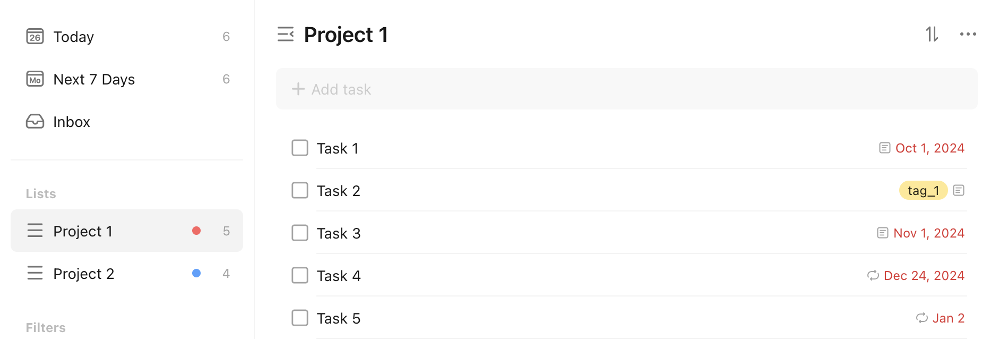
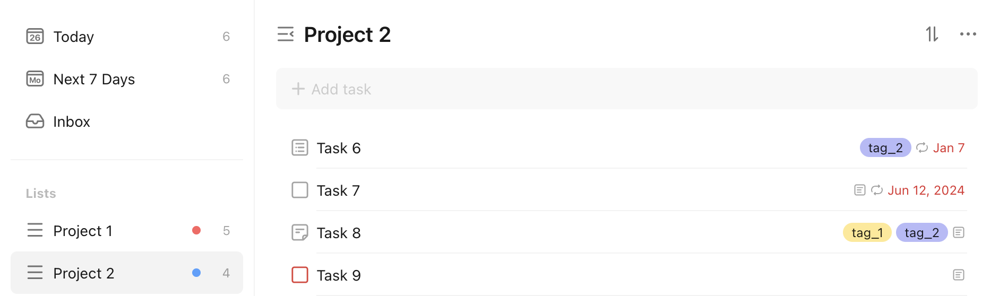

# Get All Tasks

Let's assume we want to get all tasks from the TickTick account. This is what the current tasks look like in the TickTick app:

<figure markdown="span">
    { width="90%" }
</figure>

<figure markdown="span">
    { width="90%" }
</figure>

This is what the `pyticktick` equivalent would look like:

=== "V1"

    ```python
    import json
    from pyticktick import Client

    client = Client()
    projects = client.get_projects_v1()
    for project in projects:
        data = client.get_project_with_data_v1(project_id=project.id)
        for task in data.tasks:
            print(json.dumps(task.model_dump(mode="json"), indent=4))
    ```

    will return:

    ```json
    {
        "id": "6834aabbec201a7f471a2e80",
        "project_id": "6834a28d8f08df73a73c46a8",
        "title": "Task 5",
        "is_all_day": true,
        "completed_time": null,
        "content": "",
        "desc": null,
        "due_date": "2025-01-02T06:00:00.000+0000",
        "items": null,
        "priority": 0,
        "reminders": null,
        "repeat_flag": "RRULE:FREQ=WEEKLY;INTERVAL=1;BYDAY=WE,MO,TU,TH,FR",
        "sort_order": 3298534883328,
        "start_date": "2025-01-02T06:00:00.000+0000",
        "status": false,
        "time_zone": "America/Chicago"
    }
    {
        "id": "6834aaa4ec201a7f471a2e6f",
        "project_id": "6834a28d8f08df73a73c46a8",
        "title": "Task 4",
        "is_all_day": true,
        "completed_time": null,
        "content": "",
        "desc": null,
        "due_date": "2024-12-24T06:00:00.000+0000",
        "items": null,
        "priority": 0,
        "reminders": null,
        "repeat_flag": "RRULE:FREQ=WEEKLY;INTERVAL=1",
        "sort_order": 2199023255552,
        "start_date": "2024-12-24T06:00:00.000+0000",
        "status": false,
        "time_zone": "America/Chicago"
    }
    {
        "id": "6834aa69ec201a7f471a2de4",
        "project_id": "6834a28d8f08df73a73c46a8",
        "title": "Task 3",
        "is_all_day": true,
        "completed_time": null,
        "content": "Description for task 3",
        "desc": null,
        "due_date": "2024-11-01T05:00:00.000+0000",
        "items": null,
        "priority": 0,
        "reminders": [
            "TRIGGER:-P0DT15H0M0S",
            "TRIGGER:-P1DT15H0M0S"
        ],
        "repeat_flag": null,
        "sort_order": 1099511627776,
        "start_date": "2024-11-01T05:00:00.000+0000",
        "status": false,
        "time_zone": "America/Chicago"
    }
    {
        "id": "6834aa23ec201a7f471a2db7",
        "project_id": "6834a28d8f08df73a73c46a8",
        "title": "Task 1",
        "is_all_day": false,
        "completed_time": null,
        "content": "Description for task 1",
        "desc": null,
        "due_date": "2024-10-01T16:00:00.000+0000",
        "items": null,
        "priority": 0,
        "reminders": [
            "TRIGGER:PT0S"
        ],
        "repeat_flag": null,
        "sort_order": -1099511627776,
        "start_date": "2024-10-01T16:00:00.000+0000",
        "status": false,
        "time_zone": "America/Chicago"
    }
    {
        "id": "6834aa45ec201a7f471a2dcc",
        "project_id": "6834a28d8f08df73a73c46a8",
        "title": "Task 2 ",
        "is_all_day": false,
        "completed_time": null,
        "content": "Description for task 2",
        "desc": null,
        "due_date": null,
        "items": null,
        "priority": 0,
        "reminders": null,
        "repeat_flag": null,
        "sort_order": 0,
        "start_date": null,
        "status": false,
        "time_zone": "America/Chicago"
    }
    {
        "id": "6834aadcec201a7f471a2e9a",
        "project_id": "6834a2938f08df73a73c4766",
        "title": "Task 6 ",
        "is_all_day": true,
        "completed_time": null,
        "content": "",
        "desc": "This is the description for a checklist task",
        "due_date": "2025-01-07T06:00:00.000+0000",
        "items": [
            {
                "id": "6834aae9ec201a7f471a2ea8",
                "title": "Checklist item 1",
                "status": false,
                "completed_time": null,
                "is_all_day": false,
                "sort_order": 0,
                "start_date": null,
                "time_zone": "America/Chicago"
            },
            {
                "id": "6834aaefec201a7f471a2ead",
                "title": "Checklist item 2",
                "status": false,
                "completed_time": null,
                "is_all_day": false,
                "sort_order": 1099511627776,
                "start_date": null,
                "time_zone": "America/Chicago"
            },
            {
                "id": "6834aaf8ec201a7f471a2eba",
                "title": "Checklist item 3",
                "status": false,
                "completed_time": null,
                "is_all_day": false,
                "sort_order": 2199023255552,
                "start_date": null,
                "time_zone": "America/Chicago"
            },
            {
                "id": "6834aafbec201a7f471a2ebe",
                "title": "Checklist item 4",
                "status": false,
                "completed_time": null,
                "is_all_day": false,
                "sort_order": 3298534883328,
                "start_date": null,
                "time_zone": "America/Chicago"
            },
            {
                "id": "6834aafeec201a7f471a2ec2",
                "title": "Checklist item 5",
                "status": false,
                "completed_time": null,
                "is_all_day": false,
                "sort_order": 4398046511104,
                "start_date": null,
                "time_zone": "America/Chicago"
            }
        ],
        "priority": 0,
        "reminders": [
            "TRIGGER:-P6DT15H0M0S"
        ],
        "repeat_flag": "RRULE:FREQ=WEEKLY;INTERVAL=1;WKST=SU",
        "sort_order": -1099511627776,
        "start_date": "2025-01-07T06:00:00.000+0000",
        "status": false,
        "time_zone": "America/Chicago"
    }
    {
        "id": "6834b5bbec201a7f471a2efa",
        "project_id": "6834a2938f08df73a73c4766",
        "title": "Task 8",
        "is_all_day": true,
        "completed_time": null,
        "content": "This is a note task",
        "desc": "",
        "due_date": "2024-12-12T06:00:00.000+0000",
        "items": null,
        "priority": 0,
        "reminders": null,
        "repeat_flag": null,
        "sort_order": 1099511627776,
        "start_date": "2024-12-12T06:00:00.000+0000",
        "status": false,
        "time_zone": "America/Chicago"
    }
    {
        "id": "6834ab3dec201a7f471a2ed5",
        "project_id": "6834a2938f08df73a73c4766",
        "title": "Task 7",
        "is_all_day": true,
        "completed_time": null,
        "content": "This is task 7",
        "desc": null,
        "due_date": "2024-06-12T05:00:00.000+0000",
        "items": null,
        "priority": 0,
        "reminders": null,
        "repeat_flag": "RRULE:FREQ=MONTHLY;INTERVAL=2;TT_SKIP=WEEKEND",
        "sort_order": 0,
        "start_date": "2024-06-12T05:00:00.000+0000",
        "status": false,
        "time_zone": "America/Chicago"
    }
    {
        "id": "6834b5e3ec201a7f471a2f12",
        "project_id": "6834a2938f08df73a73c4766",
        "title": "Task 9",
        "is_all_day": false,
        "completed_time": null,
        "content": "This is a high priority task",
        "desc": null,
        "due_date": null,
        "items": null,
        "priority": 5,
        "reminders": null,
        "repeat_flag": null,
        "sort_order": 2199023255552,
        "start_date": null,
        "status": false,
        "time_zone": "America/Chicago"
    }
    ```

=== "V2"

    ```python
    import json
    from pyticktick import Client

    client = Client()
    resp = client.get_batch_v2()
    for task in resp.sync_task_bean.update:
        print(json.dumps(task.model_dump(mode="json"), indent=4))
    ```

    will return:

    ```json
    {
        "child_ids": null,
        "completed_time": null,
        "content": "",
        "created_time": "2025-05-26T17:54:36Z",
        "desc": "This is the description for a checklist task",
        "due_date": "2025-01-07T06:00:00Z",
        "etag": "i08y7lxi",
        "id": "6834aadcec201a7f471a2e9a",
        "is_all_day": true,
        "is_floating": false,
        "items": [
            {
                "completed_time": null,
                "id": "6834aae9ec201a7f471a2ea8",
                "is_all_day": false,
                "sort_order": 0,
                "start_date": null,
                "status": 0,
                "time_zone": "America/Chicago",
                "title": "Checklist item 1",
                "snooze_reminder_time": null
            },
            {
                "completed_time": null,
                "id": "6834aaefec201a7f471a2ead",
                "is_all_day": false,
                "sort_order": 1099511627776,
                "start_date": null,
                "status": 0,
                "time_zone": "America/Chicago",
                "title": "Checklist item 2",
                "snooze_reminder_time": null
            },
            {
                "completed_time": null,
                "id": "6834aaf8ec201a7f471a2eba",
                "is_all_day": false,
                "sort_order": 2199023255552,
                "start_date": null,
                "status": 0,
                "time_zone": "America/Chicago",
                "title": "Checklist item 3",
                "snooze_reminder_time": null
            },
            {
                "completed_time": null,
                "id": "6834aafbec201a7f471a2ebe",
                "is_all_day": false,
                "sort_order": 3298534883328,
                "start_date": null,
                "status": 0,
                "time_zone": "America/Chicago",
                "title": "Checklist item 4",
                "snooze_reminder_time": null
            },
            {
                "completed_time": null,
                "id": "6834aafeec201a7f471a2ec2",
                "is_all_day": false,
                "sort_order": 4398046511104,
                "start_date": null,
                "status": 0,
                "time_zone": "America/Chicago",
                "title": "Checklist item 5",
                "snooze_reminder_time": null
            }
        ],
        "kind": "CHECKLIST",
        "modified_time": "2025-05-26T17:56:19Z",
        "parent_id": null,
        "priority": 0,
        "progress": 0,
        "project_id": "6834a2938f08df73a73c4766",
        "reminder": null,
        "reminders": [
            {
                "id": "6834aad3ec201a7f471a2e96",
                "trigger": "TRIGGER:-P6DT15H0M0S"
            }
        ],
        "repeat_first_date": null,
        "repeat_flag": "RRULE:FREQ=WEEKLY;INTERVAL=1;WKST=SU",
        "repeat_from": 1,
        "repeat_task_id": null,
        "start_date": "2025-01-07T06:00:00Z",
        "status": 0,
        "tags": [
            "tag_2"
        ],
        "title": "Task 6 ",
        "time_zone": "America/Chicago",
        "attachments": [],
        "annoying_alert": null,
        "column_id": null,
        "comment_count": null,
        "completed_user_id": null,
        "creator": 126406863,
        "deleted": 0,
        "ex_date": [],
        "img_mode": null,
        "focus_summaries": [],
        "sort_order": -1099511627776
    }
    {
        "child_ids": null,
        "completed_time": null,
        "content": "This is a note task",
        "created_time": "2025-05-26T18:40:59Z",
        "desc": "",
        "due_date": "2024-12-12T06:00:00Z",
        "etag": "sffsnp5r",
        "id": "6834b5bbec201a7f471a2efa",
        "is_all_day": true,
        "is_floating": false,
        "items": [],
        "kind": "NOTE",
        "modified_time": "2025-05-26T18:41:48Z",
        "parent_id": null,
        "priority": 0,
        "progress": 0,
        "project_id": "6834a2938f08df73a73c4766",
        "reminder": null,
        "reminders": [],
        "repeat_first_date": null,
        "repeat_flag": null,
        "repeat_from": 1,
        "repeat_task_id": null,
        "start_date": "2024-12-12T06:00:00Z",
        "status": 0,
        "tags": [
            "tag_1",
            "tag_2"
        ],
        "title": "Task 8",
        "time_zone": "America/Chicago",
        "attachments": [],
        "annoying_alert": null,
        "column_id": null,
        "comment_count": null,
        "completed_user_id": null,
        "creator": 126406863,
        "deleted": 0,
        "ex_date": [],
        "img_mode": null,
        "focus_summaries": [],
        "sort_order": 1099511627776
    }
    {
        "child_ids": null,
        "completed_time": null,
        "content": "This is task 7",
        "created_time": "2025-05-26T17:56:13Z",
        "desc": null,
        "due_date": "2024-06-12T05:00:00Z",
        "etag": "ouzd254o",
        "id": "6834ab3dec201a7f471a2ed5",
        "is_all_day": true,
        "is_floating": false,
        "items": [],
        "kind": "TEXT",
        "modified_time": "2025-05-26T17:56:16Z",
        "parent_id": null,
        "priority": 0,
        "progress": 0,
        "project_id": "6834a2938f08df73a73c4766",
        "reminder": null,
        "reminders": [],
        "repeat_first_date": null,
        "repeat_flag": "RRULE:FREQ=MONTHLY;INTERVAL=2;TT_SKIP=WEEKEND",
        "repeat_from": 1,
        "repeat_task_id": null,
        "start_date": "2024-06-12T05:00:00Z",
        "status": 0,
        "tags": [],
        "title": "Task 7",
        "time_zone": "America/Chicago",
        "attachments": [],
        "annoying_alert": null,
        "column_id": null,
        "comment_count": null,
        "completed_user_id": null,
        "creator": 126406863,
        "deleted": 0,
        "ex_date": [],
        "img_mode": null,
        "focus_summaries": [],
        "sort_order": 0
    }
    {
        "child_ids": null,
        "completed_time": null,
        "content": "This is a high priority task",
        "created_time": "2025-05-26T18:41:39Z",
        "desc": null,
        "due_date": null,
        "etag": "e5agjrg5",
        "id": "6834b5e3ec201a7f471a2f12",
        "is_all_day": null,
        "is_floating": false,
        "items": [],
        "kind": "TEXT",
        "modified_time": "2025-05-26T18:41:46Z",
        "parent_id": null,
        "priority": 5,
        "progress": 0,
        "project_id": "6834a2938f08df73a73c4766",
        "reminder": "",
        "reminders": [],
        "repeat_first_date": null,
        "repeat_flag": null,
        "repeat_from": null,
        "repeat_task_id": null,
        "start_date": null,
        "status": 0,
        "tags": [],
        "title": "Task 9",
        "time_zone": "America/Chicago",
        "attachments": [],
        "annoying_alert": null,
        "column_id": null,
        "comment_count": null,
        "completed_user_id": null,
        "creator": 126406863,
        "deleted": 0,
        "ex_date": [],
        "img_mode": null,
        "focus_summaries": [],
        "sort_order": 2199023255552
    }
    {
        "child_ids": null,
        "completed_time": null,
        "content": "",
        "created_time": "2025-05-26T17:54:03Z",
        "desc": null,
        "due_date": "2025-01-02T06:00:00Z",
        "etag": "umaki4zx",
        "id": "6834aabbec201a7f471a2e80",
        "is_all_day": true,
        "is_floating": false,
        "items": [],
        "kind": "TEXT",
        "modified_time": "2025-05-26T17:54:08Z",
        "parent_id": null,
        "priority": 0,
        "progress": 0,
        "project_id": "6834a28d8f08df73a73c46a8",
        "reminder": null,
        "reminders": [],
        "repeat_first_date": null,
        "repeat_flag": "RRULE:FREQ=WEEKLY;INTERVAL=1;BYDAY=WE,MO,TU,TH,FR",
        "repeat_from": 2,
        "repeat_task_id": null,
        "start_date": "2025-01-02T06:00:00Z",
        "status": 0,
        "tags": [],
        "title": "Task 5",
        "time_zone": "America/Chicago",
        "attachments": [],
        "annoying_alert": null,
        "column_id": null,
        "comment_count": null,
        "completed_user_id": null,
        "creator": 126406863,
        "deleted": 0,
        "ex_date": [],
        "img_mode": null,
        "focus_summaries": [],
        "sort_order": 3298534883328
    }
    {
        "child_ids": null,
        "completed_time": null,
        "content": "",
        "created_time": "2025-05-26T17:53:40Z",
        "desc": null,
        "due_date": "2024-12-24T06:00:00Z",
        "etag": "3h9y1quj",
        "id": "6834aaa4ec201a7f471a2e6f",
        "is_all_day": true,
        "is_floating": false,
        "items": [],
        "kind": "TEXT",
        "modified_time": "2025-05-26T17:53:50.197000Z",
        "parent_id": null,
        "priority": 0,
        "progress": 0,
        "project_id": "6834a28d8f08df73a73c46a8",
        "reminder": null,
        "reminders": [],
        "repeat_first_date": null,
        "repeat_flag": "RRULE:FREQ=WEEKLY;INTERVAL=1",
        "repeat_from": 2,
        "repeat_task_id": null,
        "start_date": "2024-12-24T06:00:00Z",
        "status": 0,
        "tags": [],
        "title": "Task 4",
        "time_zone": "America/Chicago",
        "attachments": [],
        "annoying_alert": null,
        "column_id": null,
        "comment_count": null,
        "completed_user_id": null,
        "creator": 126406863,
        "deleted": 0,
        "ex_date": [],
        "img_mode": null,
        "focus_summaries": [],
        "sort_order": 2199023255552
    }
    {
        "child_ids": [],
        "completed_time": null,
        "content": "Description for task 3",
        "created_time": "2025-05-26T17:52:41Z",
        "desc": null,
        "due_date": "2024-11-01T05:00:00Z",
        "etag": "kfzwfwax",
        "id": "6834aa69ec201a7f471a2de4",
        "is_all_day": true,
        "is_floating": false,
        "items": [],
        "kind": "TEXT",
        "modified_time": "2025-05-26T17:53:50.191000Z",
        "parent_id": null,
        "priority": 0,
        "progress": 0,
        "project_id": "6834a28d8f08df73a73c46a8",
        "reminder": null,
        "reminders": [
            {
                "id": "6834aa64ec201a7f471a2de0",
                "trigger": "TRIGGER:-P0DT15H0M0S"
            },
            {
                "id": "6834aa64ec201a7f471a2de1",
                "trigger": "TRIGGER:-P1DT15H0M0S"
            }
        ],
        "repeat_first_date": null,
        "repeat_flag": null,
        "repeat_from": null,
        "repeat_task_id": null,
        "start_date": "2024-11-01T05:00:00Z",
        "status": 0,
        "tags": [],
        "title": "Task 3",
        "time_zone": "America/Chicago",
        "attachments": [],
        "annoying_alert": null,
        "column_id": null,
        "comment_count": null,
        "completed_user_id": null,
        "creator": 126406863,
        "deleted": 0,
        "ex_date": [],
        "img_mode": null,
        "focus_summaries": [],
        "sort_order": 1099511627776
    }
    {
        "child_ids": [],
        "completed_time": null,
        "content": "Description for task 1",
        "created_time": "2025-05-26T17:51:31Z",
        "desc": null,
        "due_date": "2024-10-01T16:00:00Z",
        "etag": "qn45qq76",
        "id": "6834aa23ec201a7f471a2db7",
        "is_all_day": false,
        "is_floating": false,
        "items": [],
        "kind": "TEXT",
        "modified_time": "2025-05-26T17:52:11.446000Z",
        "parent_id": null,
        "priority": 0,
        "progress": 0,
        "project_id": "6834a28d8f08df73a73c46a8",
        "reminder": "TRIGGER:PT0S",
        "reminders": [
            {
                "id": "6834aa1cec201a7f471a2db4",
                "trigger": "TRIGGER:PT0S"
            }
        ],
        "repeat_first_date": null,
        "repeat_flag": null,
        "repeat_from": null,
        "repeat_task_id": null,
        "start_date": "2024-10-01T16:00:00Z",
        "status": 0,
        "tags": [],
        "title": "Task 1",
        "time_zone": "America/Chicago",
        "attachments": [],
        "annoying_alert": null,
        "column_id": null,
        "comment_count": null,
        "completed_user_id": null,
        "creator": 126406863,
        "deleted": 0,
        "ex_date": [],
        "img_mode": null,
        "focus_summaries": [],
        "sort_order": -1099511627776
    }
    {
        "child_ids": null,
        "completed_time": null,
        "content": "Description for task 2",
        "created_time": "2025-05-26T17:52:05Z",
        "desc": null,
        "due_date": null,
        "etag": "qder45zu",
        "id": "6834aa45ec201a7f471a2dcc",
        "is_all_day": null,
        "is_floating": false,
        "items": [],
        "kind": "TEXT",
        "modified_time": "2025-05-26T17:52:11.449000Z",
        "parent_id": null,
        "priority": 0,
        "progress": 0,
        "project_id": "6834a28d8f08df73a73c46a8",
        "reminder": "",
        "reminders": [],
        "repeat_first_date": null,
        "repeat_flag": null,
        "repeat_from": null,
        "repeat_task_id": null,
        "start_date": null,
        "status": 0,
        "tags": [
            "tag_1"
        ],
        "title": "Task 2 ",
        "time_zone": "America/Chicago",
        "attachments": [],
        "annoying_alert": null,
        "column_id": null,
        "comment_count": null,
        "completed_user_id": null,
        "creator": 126406863,
        "deleted": 0,
        "ex_date": [],
        "img_mode": null,
        "focus_summaries": [],
        "sort_order": 0
    }
    ```
