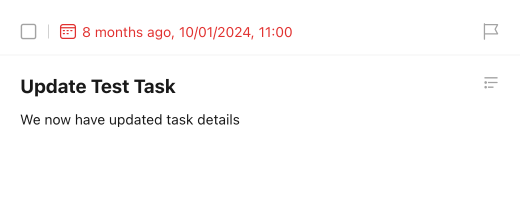

# Update a Basic Task

Let's assume we want to update the task from the [create a basic task recipe](./create_a_basic_task.md) with the following properties:

- Name: `Update Test Task`
- Description: `We now have updated task details`
- Due Date: `2024-10-02` at `11:00 AM`
- Alarm: At the time of the due date
- Time zone: `Chicago`

This will be updated under the same project with ID `683217b48f08892e6997ef03`, called `Test Project`.

This is what the `pyticktick` code would look like:

=== "V1 - dict"

    ```python
    import json
    from pyticktick import Client

    client = Client()
    task = client.update_task_v1(
        task_id="68336a02ec201a48c7aadedf",
        data={
            "id": "68336a02ec201a48c7aadedf",
            "title": "Update Test Task",
            "content": "We now have updated task details",
            "due_date": "2024-10-02T11:00:00+0000",
            "reminders": ["TRIGGER:PT0S"],
            "time_zone": "America/Chicago",
            "project_id": "683217b48f08892e6997ef03",
        },
    )
    print(json.dumps(task.model_dump(mode="json"), indent=4))
    ```

    will return:

    ```json
    {
        "id": "68336a02ec201a48c7aadedf",
        "project_id": "683217b48f08892e6997ef03",
        "title": "Update Test Task",
        "is_all_day": false,
        "completed_time": null,
        "content": "We now have updated task details",
        "desc": null,
        "due_date": "2024-10-02T11:00:00.000+0000",
        "items": null,
        "priority": 0,
        "reminders": [
            "TRIGGER:PT0S"
        ],
        "repeat_flag": null,
        "sort_order": -1099511627776,
        "start_date": "2024-10-02T11:00:00.000+0000",
        "status": false,
        "time_zone": "America/Chicago"
    }
    ```

=== "V1 - model"

    ```python
    import json
    from pyticktick import Client
    from pyticktick.models.v1 import UpdateTaskV1

    client = Client()
    task = client.update_task_v1(
        task_id="68336a02ec201a48c7aadedf",
        data=UpdateTaskV1(
            id="68336a02ec201a48c7aadedf",
            title="Update Test Task",
            content="We now have updated task details",
            due_date="2024-10-02T11:00:00+0000",
            reminders=["TRIGGER:PT0S"],
            time_zone="America/Chicago",
            project_id="683217b48f08892e6997ef03",
        ),
    )
    print(json.dumps(task.model_dump(mode="json"), indent=4))
    ```

    will return:

    ```json
    {
        "id": "68336a02ec201a48c7aadedf",
        "project_id": "683217b48f08892e6997ef03",
        "title": "Update Test Task",
        "is_all_day": false,
        "completed_time": null,
        "content": "We now have updated task details",
        "desc": null,
        "due_date": "2024-10-02T11:00:00.000+0000",
        "items": null,
        "priority": 0,
        "reminders": [
            "TRIGGER:PT0S"
        ],
        "repeat_flag": null,
        "sort_order": -1099511627776,
        "start_date": "2024-10-02T11:00:00.000+0000",
        "status": false,
        "time_zone": "America/Chicago"
    }
    ```

=== "V2 - dict"

    ```python
    import json
    from pyticktick import Client

    client = Client()

    data = client.get_batch_v2()
    for task in data.sync_task_bean.update:
        if task.id == "68336a02ec201a48c7aadedf":
            break

    resp = client.post_task_v2(
        data={
            "update": [
                {
                    "id": task.id,
                    "title": "Update Test Task",
                    "content": "We now have updated task details",
                    "due_date": "2024-10-02T11:00:00+0000",
                    "reminders": [
                        {
                            "id": reminder.id,
                            "trigger": reminder.trigger,
                        }
                        for reminder in task.reminders
                    ],
                    "time_zone": task.time_zone,
                    "project_id": task.project_id,
                },
            ],
        },
    )
    print(json.dumps(resp.model_dump(mode="json"), indent=4))
    ```

    will return:

    ```json
    {
        "id2error": {},
        "id2etag": {
            "68336a02ec201a48c7aadedf": "zyu8w113"
        }
    }
    ```

=== "V2 - model"

    ```python
    import json
    from pyticktick import Client
    from pyticktick.models.v2 import PostBatchTaskV2, UpdateTaskReminderV2, UpdateTaskV2

    client = Client()

    data = client.get_batch_v2()
    for task in data.sync_task_bean.update:
        if task.id == "68336a02ec201a48c7aadedf":
            break

    resp = client.post_task_v2(
        data=PostBatchTaskV2(
            update=[
                UpdateTaskV2(
                    id=task.id,
                    title="Update Test Task",
                    content="We now have updated task details",
                    due_date="2024-10-02T11:00:00+0000",
                    reminders=[
                        UpdateTaskReminderV2(
                            id=reminder.id,
                            trigger=reminder.trigger,
                        )
                        for reminder in task.reminders
                    ],
                    time_zone=task.time_zone,
                    project_id=task.project_id,
                ),
            ],
        ),
    )
    print(json.dumps(resp.model_dump(mode="json"), indent=4))
    ```

    will return:

    ```json
    {
        "id2error": {},
        "id2etag": {
            "68336a02ec201a48c7aadedf": "zyu8w113"
        }
    }
    ```

Here is the end result in the TickTick app:

<figure markdown="span">
    { width="450px" }
</figure>
