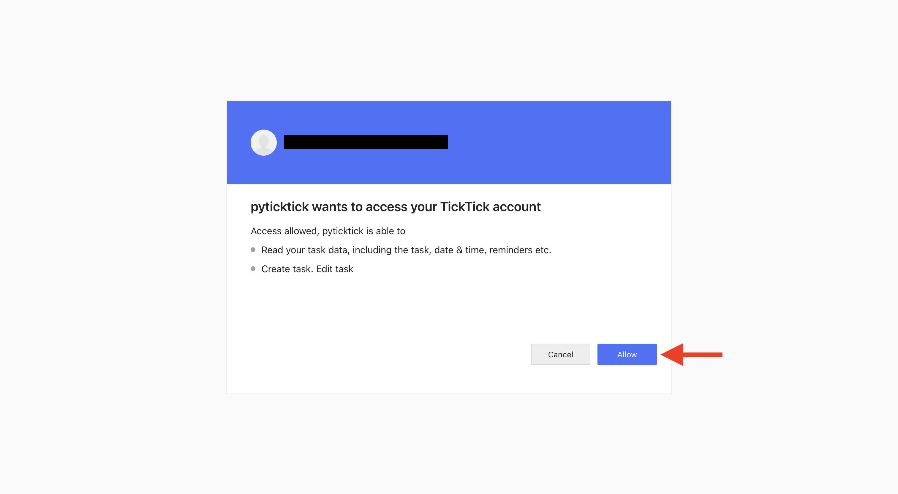

# Generate a V1 Token

## Introduction

??? question "Have you registered your app?"

    You cannot generate a V1 token until you have registered your app and received your client ID, client secret, and OAuth redirect URL. You can find the guide to do this [here](register_v1_app.md).

To generate a V1 token, you will need to have your client ID, client secret, and OAuth redirect URL in hand. This guide will walk you through the script [`scripts/generate_v1_token.py`](https://github.com/sebpretzer/pyticktick/blob/main/scripts/generate_v1_token.py), which will generate a V1 token for you. If you just want to generate a V1 token without using the script, you can skip down to the [Code TLDR](#code-tldr-optional) section.

At the end of this guide, you will have a V1 token (in the form of a UUID) and an expiration time (in the form of a unix seconds timestamp). Both of these are useful when making requests to the V1 API.

## Run the Script

??? question "Have you set up your local environment?"

    Make sure your local environment is set up by following the steps in the [Setting Up the Local Environment](./../development/setup_local_environment.md) guide.

To run `scripts/generate_v1_token.py`, run the following command:

```bash
make generate-v1-token
```

### Enter Your Credentials

This will prompt you to enter your client ID, client secret, and OAuth redirect URL:

```bash
Enter your client_id: YOUR_CLIENT_ID
Enter your client_secret: YOUR_CLIENT_SECRET
Enter your OAuth redirect URL: http://127.0.0.1:8080/
```

### Open the URL

A URL will be printed to the console. You can either copy paste this URL into your browser or hit enter to open the URL in your default browser.

```bash
Request URL:

 https://ticktick.com/oauth/authorize?client_id=YOUR_CLIENT_ID&scope=tasks%3Aread+tasks%3Awrite&state=None&response_type=code

Open the browser to signon to the V1 API? [Y/n]: Y
```

This will take you to the TickTick login page. Log in with your account and click "Allow" to grant access to your app:

<figure markdown="span">
    { width="75%" }
</figure>

### Copy the Code

**Do not close the browser window.** You will be redirected to (possibly non-functioning) page with a code. Copy the entire URL and paste it back into the console:

```bash
What is the URL you were redirected to?: http://127.0.0.1:8080/?code=jAyEtF&state=None
```

### Get Your Token

The python process should have your token stored in memory. There are a few ways to get the token at this point. You can either send the token and expiration time to your clipboard, or print it to the console, or save it to a file. The script will prompt you for your choice in that respective order, and whichever you choose will skip the following prompts:

```bash
Do you want the token to be copied to the clipboard? [Y/n]:
...
Do you want to print the token and its expiration? [Y/n]:
...
Enter the file path to save the token and expiration:
```

Then follow any additional prompts to complete the process.

## Code TLDR (Optional)

The actual code required to generate a V1 token is quite simple:

```python
from pyticktick import Settings

client_id = "YOUR_CLIENT_ID"
client_secret = "YOUR_CLIENT_SECRET"
redirect_url = "http://127.0.0.1:8080/"

token = Settings.v1_signon(client_id, client_secret, redirect_url)
token_value = token.access_token
token_expiration = token.expires_in + int(time())
```

Then just make sure you follow the same steps laid out in [_Open the URL_](#open-the-url) and [_Copy the Code_](#copy-the-code) sections. Then the rest will be up to you to decide how you want to handle the token.
