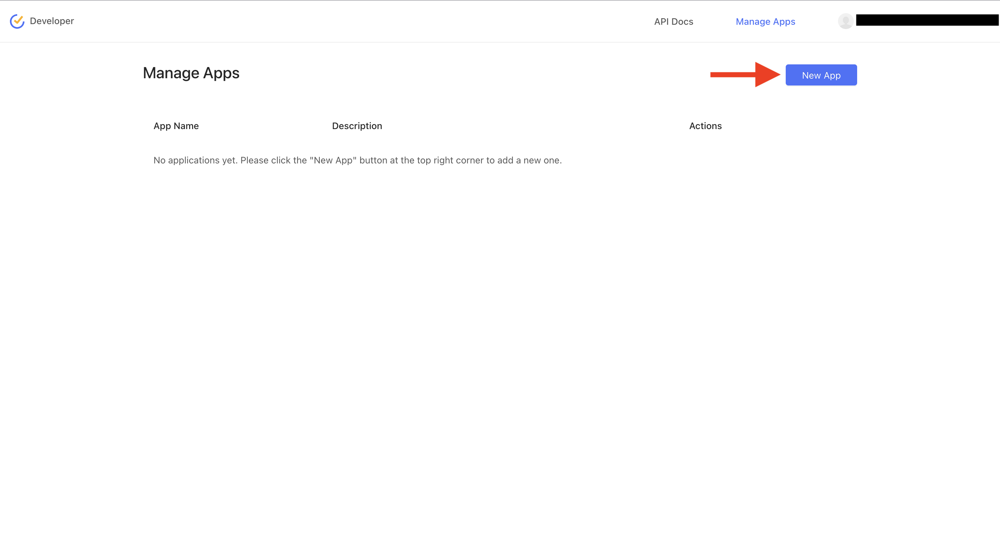
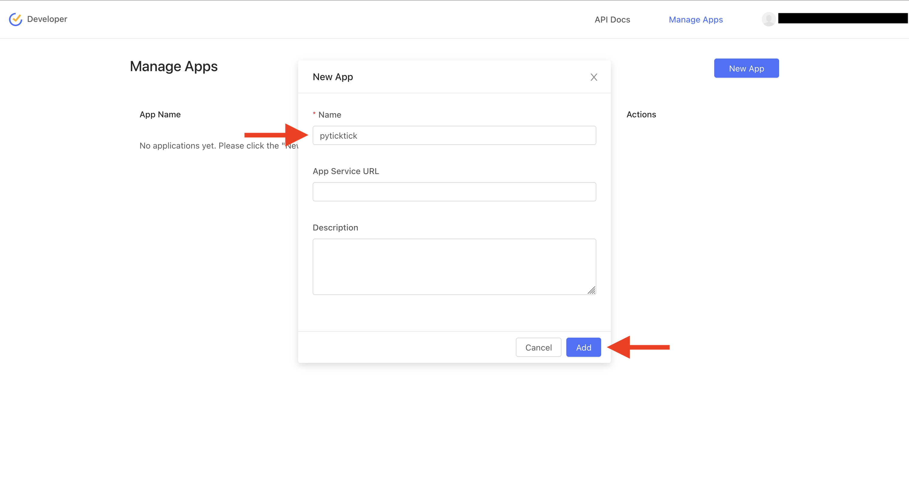
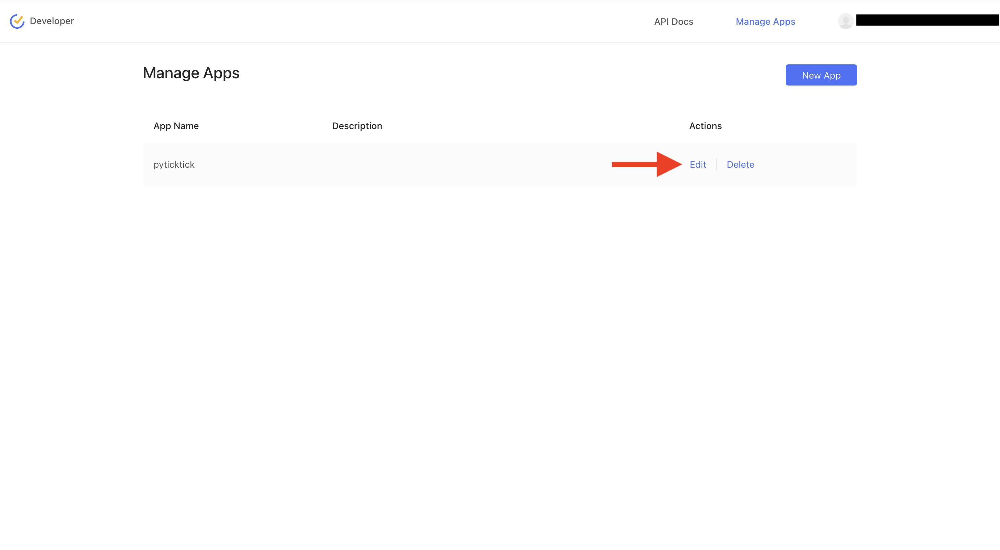
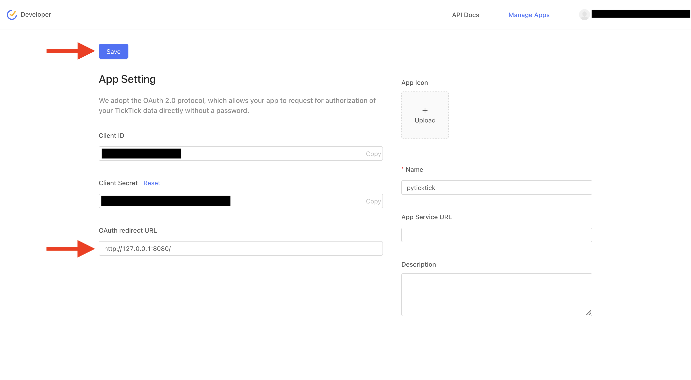

# Register a V1 App

This guide will walk you through the process of registering an app for the V1 API. Once registered, you will receive a client ID, client secret, and be able to set an OAuth redirect URL. These credentials are required to generate a V1 token.

First, head to the [Manage Apps](https://developer.ticktick.com/manage) page and log in with your TickTick account.

Once logged in, click the "New App" button.

<figure markdown="span">
    { width="75%" }
</figure>

The only requirement is that you name your app, but you can also provide a description if you wish. Once you have filled in the required fields, click the "Add" button.

<figure markdown="span">
    { width="75%" }
</figure>

You will now see your app listed on the "Manage Apps" page. Click "Edit" to view your credentials.

<figure markdown="span">
    { width="75%" }
</figure>

This is where you will see your client ID, client secret, and set your OAuth redirect URL. By default, the OAuth redirect URL is set to:

```bash
http://127.0.0.1:8080/
```

You can change this to any URL you wish. However, if you change the URL, you will need to set the `v1_oauth_redirect_url` parameter when generating a V1 token. Don't forget to click the "Save" button after making any changes.

<figure markdown="span">
    { width="75%" }
</figure>
