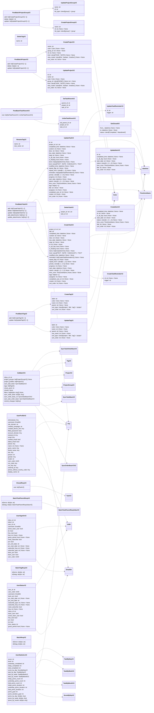

```mermaid
classDiagram
    direction LR
    class CreateProjectV2 {
        name: str
        color: Color | None = None
        group_id: str | None = None
        id: str | None = None
        kind: Literal['TASK', 'NOTE'] | None = None
        view_mode: Literal['list', 'kanban', 'timeline'] | None = None
        sort_order: int | None = None
    }

    class ClosedRespV2 {
        root: list[TaskV2]
    }

    class CreateProjectGroupV2 {
        name: str
        id: str | None = None
        list_type: Literal['group'] = 'group'
    }

    class DeleteTagV2 {
        name: str
    }

    class UserProfileV2 {
        etimestamp: Any
        username: EmailStr
        site_domain: str
        created_campaign: str
        created_device_info: Any
        filled_password: bool
        account_domain: Any
        extenal_id: Any
        email: Any
        verified_email: bool
        faked_email: bool
        phone: Any
        name: str | None = None
        given_name: Any
        family_name: Any
        link: Any
        picture: str
        gender: Any
        locale: str
        user_code: UUID
        ver_code: Any
        ver_key: Any
        external_id: Any
        phone_without_country_code: Any
        display_name: str
    }

    class UpdateItemV2 {
        id: str
        completed_time: datetime | None = None
        is_all_day: bool | None = None
        start_date: str | None = None
        status: Literal[-1, 0, 1, 2] | None = None
        time_zone: TimeZoneName | None | None = None
        title: str | None = None
        sort_order: int | None = None
    }

    class GetClosedV2 {
        from_: datetime | None = None
        to: datetime | None = None
        status: Literal['Completed', 'Abandoned']
    }

    class CreateTaskReminderV2 {
        id: str | None = None
        trigger: str
    }

    class UpdateTaskV2 {
        id: str
        project_id: str | str
        completed_time: datetime | None = None
        content: str | None = None
        desc: str | None = None
        due_date: datetime | None = None
        etag: str | None = None
        is_all_day: bool | None = None
        is_floating: bool | None = None
        items: list[UpdateItemV2] | None = None
        kind: Literal['TEXT', 'NOTE', 'CHECKLIST'] = 'TEXT'
        modified_time: datetime | None = None
        repeat_flag: str | None = None
        repeat_from: Literal[0, 1, 2] | None = None
        reminders: list[UpdateTaskReminderV2] | None = None
        priority: Literal[0, 1, 3, 5] | None = None
        progress: int | None = None
        start_date: datetime | None = None
        status: Literal[-1, 0, 1, 2] | None = None
        time_zone: TimeZoneName | None | None = None
        tags: list[str] = []
        title: str | None = None
        assignee: int | None = None
        completed_user_id: int | None = None
        creator: int | None = None
        sort_order: int | None = None
    }

    class GetBatchV2 {
        inbox_id: str
        project_groups: list[ProjectGroupV2] | None
        project_profiles: list[ProjectV2]
        sync_task_bean: SyncTaskBeanV2
        tags: list[TagV2]
        check_point: int
        checks: None
        filters: list[dict[str, Any]] | None
        sync_order_bean: dict[str, Any]
        sync_order_bean_v3: SyncOrderBeanV3V2
        sync_task_order_bean: SyncTaskOrderBeanV2
        remind_changes: list[Any]
    }

    class UpdateProjectGroupV2 {
        name: str
        id: str
        list_type: Literal['group'] = 'group'
    }

    class RenameTagV2 {
        name: str
        new_name: str
    }

    class UserSignOnV2 {
        inbox_id: str
        token: str
        user_id: str
        username: EmailStr
        active_team_user: bool
        ds: bool
        free_trial: bool
        freq: str | None = None
        grace_period: bool | None = None
        need_subscribe: bool
        pro: bool
        pro_end_date: str
        pro_start_date: str | None = None
        subscribe_freq: str | None = None
        subscribe_type: str | None = None
        team_pro: bool
        team_user: bool
        user_code: UUID
    }

    class UserStatisticsV2 {
        score: int
        level: int
        yesterday_completed: int
        today_completed: int
        total_completed: int
        score_by_day: ScoreByDayV2
        task_by_day: TaskByDayV2
        task_by_week: TaskByWeekV2
        task_by_month: TaskByMonthV2
        today_pomo_count: int
        yesterday_pomo_count: int
        total_pomo_count: int
        today_pomo_duration: int
        yesterday_pomo_duration: int
        total_pomo_duration: int
        pomo_goal: int
        pomo_duration_goal: int
        pomo_by_day: dict[str, Any]
        pomo_by_week: dict[str, Any]
        pomo_by_month: dict[str, Any]
    }

    class CreateTaskV2 {
        project_id: str | str
        title: str
        completed_time: datetime | None = None
        content: str | None = None
        desc: str | None = None
        due_date: datetime | None = None
        etag: str | None = None
        id: str | None = None
        is_all_day: bool | None = None
        is_floating: bool | None = None
        items: list[CreateItemV2] | None = None
        kind: Literal['TEXT', 'NOTE', 'CHECKLIST'] = 'TEXT'
        modified_time: datetime | None = None
        reminders: list[CreateTaskReminderV2] | None = None
        repeat_flag: str | None = None
        repeat_from: Literal[0, 1, 2] | None = None
        priority: Literal[0, 1, 3, 5] | None = None
        progress: int | None = None
        start_date: datetime | None = None
        status: Literal[-1, 0, 1, 2] | None = None
        time_zone: TimeZoneName | None | None = None
        tags: list[str] = []
        assignee: int | None = None
        completed_user_id: int | None = None
        creator: int | None = None
        sort_order: int | None = None
    }

    class CreateItemV2 {
        completed_time: datetime | None = None
        id: str | None = None
        is_all_day: bool | None = None
        start_date: str | None = None
        status: Literal[-1, 0, 1, 2] | None = None
        time_zone: TimeZoneName | None | None = None
        title: str | None = None
        sort_order: int | None = None
    }

    class UpdateTaskReminderV2 {
        id: str
        trigger: str
    }

    class PostBatchTaskParentV2 {
        root: list[SetTaskParentV2 | UnSetTaskParentV2]
    }

    class PostBatchProjectV2 {
        add: list[CreateProjectV2] = []
        delete: list[str] = []
        update: list[UpdateProjectV2] = []
    }

    class PostBatchTaskV2 {
        add: list[CreateTaskV2] = []
        delete: list[DeleteTaskV2] = []
        update: list[UpdateTaskV2] = []
        add_attachments: list[Any] = []
        update_attachments: list[Any] = []
    }

    class UnSetTaskParentV2 {
        old_parent_id: str
        project_id: str
        task_id: str
    }

    class DeleteTaskV2 {
        project_id: str | str
        task_id: str
    }

    class PostBatchProjectGroupV2 {
        add: list[CreateProjectGroupV2] = []
        delete: list[str] = []
        update: list[UpdateProjectGroupV2] = []
    }

    class SetTaskParentV2 {
        parent_id: str
        project_id: str
        task_id: str
    }

    class UserStatusV2 {
        user_id: str
        user_code: UUID
        username: EmailStr
        team_pro: bool
        pro_start_date: str | None = None
        pro_end_date: str
        subscribe_type: str | None = None
        subscribe_freq: str | None = None
        need_subscribe: bool
        freq: str | None = None
        inbox_id: str
        team_user: bool
        active_team_user: bool
        free_trial: bool
        pro: bool
        ds: bool
        time_stamp: int
        grace_period: bool | None = None
    }

    class BatchTagRespV2 {
        id2error: dict[str, str]
        id2etag: dict[str, str]
    }

    class PostBatchTagV2 {
        add: list[CreateTagV2] = []
        update: list[UpdateTagV2] = []
    }

    class CreateTagV2 {
        label: str
        color: Color | None = None
        name: str | None = None
        parent: str | None = None
        sort_type: Literal['project', 'title', 'tag'] = 'project'
        sort_order: int | None = None
    }

    class UpdateTagV2 {
        label: str
        color: Color | None = None
        name: str | None = None
        parent: str | None = None
        raw_name: str | None = None
        sort_type: Literal['project', 'title', 'tag'] = 'project'
        sort_order: int | None = None
    }

    class UpdateProjectV2 {
        id: str
        name: str
        color: Color | None = None
        group_id: Literal['NONE'] | None | str = None
        kind: Literal['TASK', 'NOTE'] | None = None
        view_mode: Literal['list', 'kanban', 'timeline'] | None = None
        sort_order: int | None = None
    }

    class BatchRespV2 {
        id2error: dict[str, str]
        id2etag: dict[str, str]
    }

    class BatchTaskParentRespV2 {
        id2error: dict[str, str]
        id2etag: dict[str, BatchTaskParentRespValueV2]
    }

    GetClosedV2 ..> datetime
    CreateProjectV2 ..> Color
    PostBatchProjectV2 ..> CreateProjectV2
    PostBatchProjectV2 ..> UpdateProjectV2
    UpdateProjectV2 ..> Color
    PostBatchProjectGroupV2 ..> UpdateProjectGroupV2
    PostBatchProjectGroupV2 ..> CreateProjectGroupV2
    CreateTagV2 ..> Color
    PostBatchTagV2 ..> CreateTagV2
    PostBatchTagV2 ..> UpdateTagV2
    UpdateTagV2 ..> Color
    CreateItemV2 ..> TimeZoneName
    CreateItemV2 ..> datetime
    CreateTaskV2 ..> CreateItemV2
    CreateTaskV2 ..> TimeZoneName
    CreateTaskV2 ..> datetime
    CreateTaskV2 ..> CreateTaskReminderV2
    PostBatchTaskV2 ..> UpdateTaskV2
    PostBatchTaskV2 ..> Any
    PostBatchTaskV2 ..> DeleteTaskV2
    PostBatchTaskV2 ..> CreateTaskV2
    UpdateItemV2 ..> TimeZoneName
    UpdateItemV2 ..> datetime
    UpdateTaskV2 ..> UpdateTaskReminderV2
    UpdateTaskV2 ..> datetime
    UpdateTaskV2 ..> UpdateItemV2
    UpdateTaskV2 ..> TimeZoneName
    PostBatchTaskParentV2 ..> SetTaskParentV2
    PostBatchTaskParentV2 ..> UnSetTaskParentV2
    GetBatchV2 ..> SyncTaskOrderBeanV2
    GetBatchV2 ..> TagV2
    GetBatchV2 ..> ProjectV2
    GetBatchV2 ..> ProjectGroupV2
    GetBatchV2 ..> Any
    GetBatchV2 ..> SyncTaskBeanV2
    GetBatchV2 ..> SyncOrderBeanV3V2
    ClosedRespV2 ..> TaskV2
    BatchTaskParentRespV2 ..> BatchTaskParentRespValueV2
    UserProfileV2 ..> Any
    UserProfileV2 ..> EmailStr
    UserProfileV2 ..> UUID
    UserSignOnV2 ..> UUID
    UserSignOnV2 ..> EmailStr
    UserStatisticsV2 ..> TaskByDayV2
    UserStatisticsV2 ..> TaskByWeekV2
    UserStatisticsV2 ..> Any
    UserStatisticsV2 ..> TaskByMonthV2
    UserStatisticsV2 ..> ScoreByDayV2
    UserStatusV2 ..> UUID
    UserStatusV2 ..> EmailStr


```

!!! info
    This was auto-generated code by [pydantic-2-mermaid](https://github.com/EricWebsmith/pydantic-2-mermaid).
